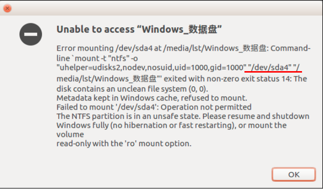

##  解决Ubuntu16.04挂载u盘时出现NTFS分区失败问题

最近在使用u盘时出现以下错误：

# ### 解决方法：

 

进入Ubuntu 16.04 系统，启动 Terminal，输入格式如下的修复命令：

`sudo ntfsfix 挂载失败的设备名`，其中设备名为上图中红色标注位置

【说明：如果朋友们的LINUX系统中没有 ntfsfix命令，请自行安装，很容易的。】

`sudo ntfsfix /dev/sda4`