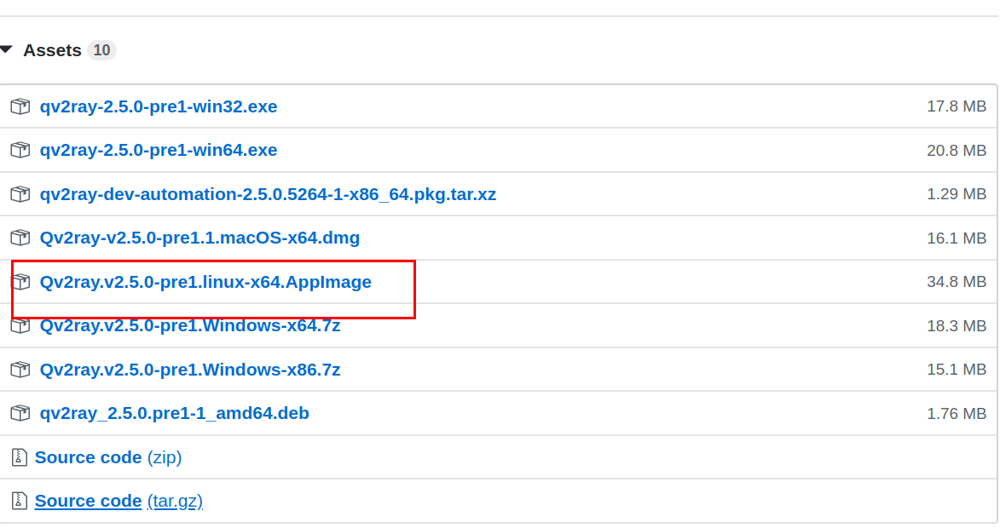
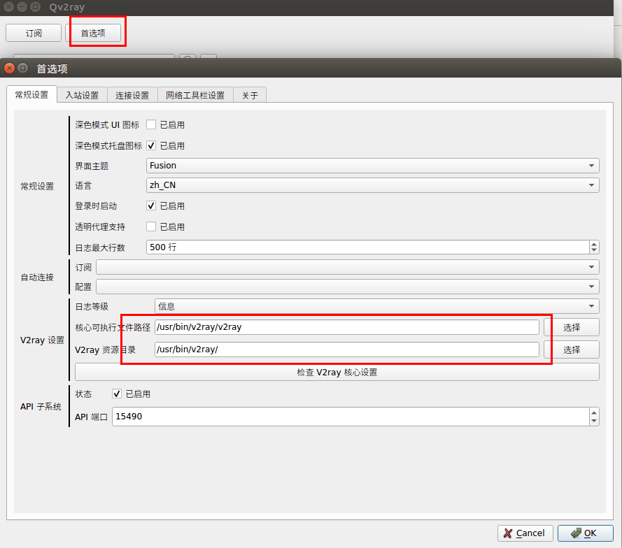
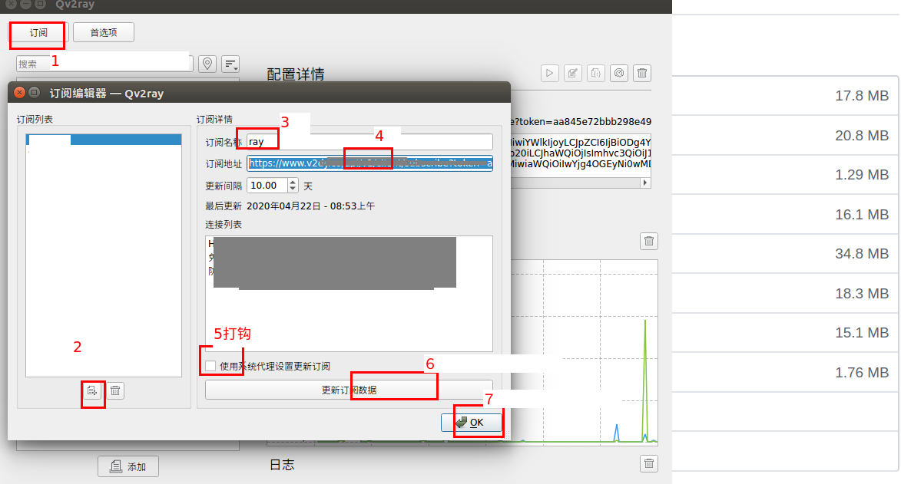

# Ubuntu安装v2ray

### 安装v2ray-core

```bash
bash <(curl -L -s https://install.direct/go.sh)
```

### 安装Qv2ray

下载地址：https://github.com/Qv2ray/Qv2ray/releases




配置v2ray_core路径



核心可执行文件路径： `/usr/bin/v2ray/v2ray`

V2ray资源目录： `/usr/bin/v2ray/`

###　添加订阅


