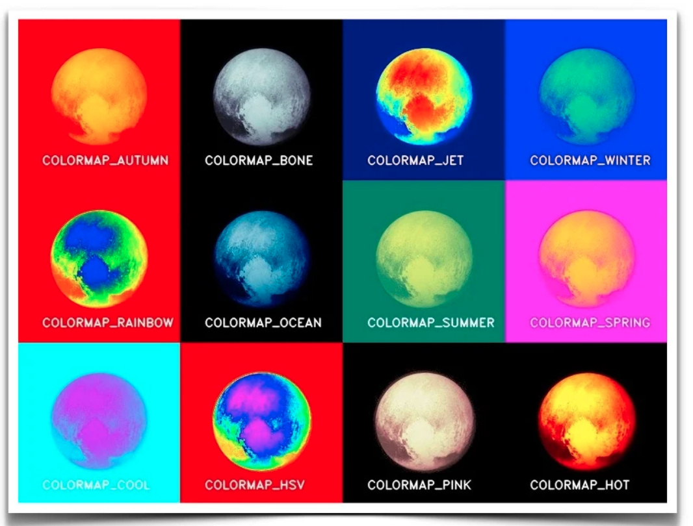

# opencv中伪彩色applyColorMap函数

**colormap（色度图）**
假设我们想在地图上显示美国不同地区的温度。我们可以把美国地图上的温度数据叠加为灰度图像——较暗的区域代表较冷的温度，更明亮的区域代表较热的区域。这样的表现不仅令人难以置信，而且代表了两个重要的原因。首先，人类视觉系统没有被优化来测量灰度强度的微小变化。我们能更好地感知颜色的变化。第二，我们用不同的颜色代表不同的意思。用蓝色和较温暖的温度用红色表示较冷的温度更有意义。
温度数据只是一个例子，但还有其他几个数据是单值（灰度）的情况，但将其转换为彩色数据以实现可视化是有意义的。用伪彩色更好地显示数据的其他例子是高度、压力、密度、湿度等等。
**在OpenCV中使用applycolormap（伪彩色函数）**
OpenCV的定义12种colormap（色度图），可以应用于灰度图像，使用函数applycolormap产生伪彩色图像。让我们很快看到如何将色度图的一种模式colormap_jet应用到一幅图像中。
`import cv2`

`im_gray = cv2.imread("pluto.jpg", cv2.IMREAD_GRAYSCALE)`
`im_color = cv2.applyColorMap(im_gray, cv2.COLORMAP_JET)`

下图显示了一个关于colormap（色度图）的视觉表示和COLORMAP_*的数值，左边的颜色模式表示较低的灰度值，右边的则表示较高的灰度值。

