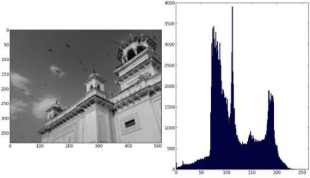
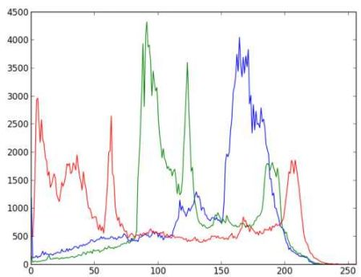
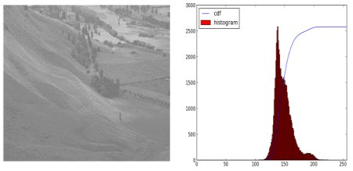
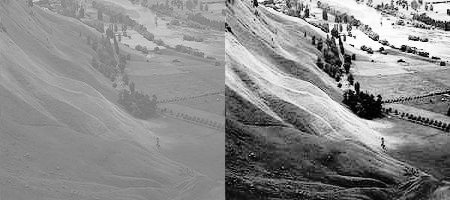
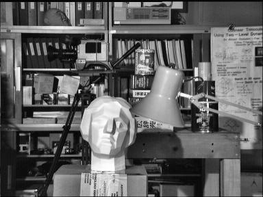
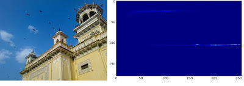
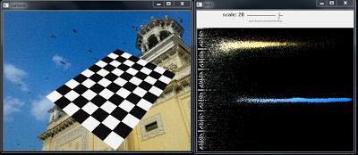

# OpenCV 中的直方图

## [直方图 - 1：查找，绘图，分析!](../../d1/db7/tutorial_py_histogram_begins.html)
学习直方图的基础知识

### 目标
学会
* 使用OpenCV和Numpy函数查找直方图
* 使用OpenCV和Matplotlib函数绘制直方图
* 您将看到以下功能：**[cv.calcHist()](https://docs.opencv.org/4.0.0/d6/dc7/group__imgproc__hist.html#ga4b2b5fd75503ff9e6844cc4dcdaed35d)** ，**np.histogram()** 等。

### 理论
那么直方图是什么？您可以将直方图视为图形或曲线图，从而使您对图像的强度分布有一个整体的了解。它是在X轴上具有像素值(不总是从0到255的范围)，在Y轴上具有图像中相应像素数的图。

这只是理解图像的另一种方式。通过查看图像的直方图，您可以直观地了解该图像的对比度，亮度，强度分布等。当今几乎所有图像处理工具都提供直方图功能。以下是 [剑桥彩色网站](http://www.cambridgeincolour.com/tutorials/histograms1.htm) 上的图片，建议您访问该网站以获取更多详细信息。


您可以看到图像及其直方图。(请记住，此直方图是针对灰度图像而非彩色图像绘制的)。直方图的左侧区域显示图像中较暗像素的数量，而右侧区域则显示较亮像素的数量。从直方图中，您可以看到暗区域多于亮区域，中间值的数量(中间值的像素值，例如127附近)非常少。

#### 查找直方图
现在我们有了一个关于直方图的想法，我们可以研究如何找到它。OpenCV和Numpy都为此内置了功能。在使用这些功能之前，我们需要了解一些与直方图有关的术语。

**BINS** ：上面的直方图显示每个像素值的像素数，即从0到255。即，您需要256个值来显示上面的直方图。但是考虑一下，如果您不需要分别找到所有像素值的像素数，而是找到像素值间隔中的像素数怎么办？例如，您需要找到介于0到15之间，然后16到31之间，...，240到255之间的像素数。您只需要16个值即可表示直方图。这就是在 [OpenCV直方图教程](http://docs.opencv.org/doc/tutorials/imgproc/histograms/histogram_calculation/histogram_calculation.html#histogram-calculation) 中给出的示例中所显示的内容。

因此，您要做的就是将整个直方图分成16个子部分，每个子部分的值就是其中所有像素数的总和。每个子部分都称为“BIN”。在第一种情况下，bin的数量为256个(每个像素一个)，而在第二种情况下，bin的数量仅为16个。BINS由OpenCV文档中的 **histSize** 术语表示。

**DIMS** ：这是我们为其收集数据的参数的数量。在这种情况下，我们仅收集关于强度值的一件事的数据。所以这里是1。

**范围** ：这是您要测量的强度值的范围。通常，它是[0,256]，即所有强度值。

##### 1. OpenCV中的直方图计算
因此，现在我们使用 **[cv.calcHist()](https://docs.opencv.org/4.0.0/d6/dc7/group__imgproc__hist.html#ga4b2b5fd75503ff9e6844cc4dcdaed35d)** 函数查找直方图。让我们熟悉一下函数及其参数：
$$
cv.calcHist(images, channels, mask, histSize, ranges[, hist[, accumulate]])
$$

1. images：它是uint8或float32类型的源图像。它应该放在方括号中，即“ [img]”。
2. channels：也以方括号给出。它是我们计算直方图的通道的索引。例如，如果输入为灰度图像，则其值为[0]。对于彩色图像，您可以传递[0]，[1]或[2]分别计算蓝色，绿色或红色通道的直方图。
3. mask：遮罩图像。为了找到完整图像的直方图，将其指定为“无”。但是，如果要查找图像特定区域的直方图，则必须为此创建一个遮罩图像并将其作为遮罩。(我将在后面显示一个示例。)
4. histSize：这表示我们的BIN计数。需要放在方括号中。对于全尺寸，我们通过[256]。
5. ranges：这是我们的RANGE。通常为[0,256]。
因此，让我们从示例图像开始。只需在灰度模式下加载图像并找到其完整的直方图即可。

```python
img = cv.imread('home.jpg',0)
hist = cv.calcHist([img],[0],None,[256],[0,256])
```
hist是256x1的数组，每个值对应于该图像中具有相应像素值的像素数。

##### 2. Numpy中的直方图计算
Numpy还为您提供了一个函数 **np.histogram()** 。因此，您可以在下面的行尝试代替 **[calcHist()](https://docs.opencv.org/4.0.0/d6/dc7/group__imgproc__hist.html#ga4b2b5fd75503ff9e6844cc4dcdaed35d)** 函数：

```python
hist,bins = np.histogram(img.ravel(),256,[0,256])
```
hist与我们之前计算的相同。但是bin将具有257个元素，因为Numpy计算出bin的范围为0-0.99、1-1.99、2-2.99等。因此最终范围为255-255.99。为了表示这一点，他们还在料箱末端添加了256。但是我们不需要256。最多255就足够了。

也可以看看
Numpy还有另一个函数 **np.bincount()** ，它比np.histogram()快10倍左右。因此，对于一维直方图，您可以更好地尝试一下。不要忘记在np.bincount中设置minlength = 256。例如，hist = np.bincount(img.ravel()，minlength = 256)

> **注意**
> OpenCV函数比 np.histogram() 快(大约40倍)。因此，请坚持使用OpenCV功能。

现在我们应该绘制直方图，但是如何？

#### 绘制直方图
有两种方法，
1. 简短方法：使用Matplotlib绘图功能
2. 很长的路要走：使用OpenCV绘图功能

##### 1.使用Matplotlib
Matplotlib带有直方图绘图功能：matplotlib.pyplot.hist()

它直接找到直方图并将其绘制。您无需使用 **[calcHist()](https://docs.opencv.org/4.0.0/d6/dc7/group__imgproc__hist.html#ga4b2b5fd75503ff9e6844cc4dcdaed35d)** 或 np.histogram() 函数来查找直方图。请参见下面的代码：

```python
import numpy as np
import cv2 as cv
from matplotlib import pyplot as plt
img = cv.imread('home.jpg',0)
plt.hist(img.ravel(),256,[0,256]); plt.show()
```
您将得到如下图：




或者，您可以使用matplotlib的法线图，这对于BGR图是很好的。为此，您需要首先找到直方图数据。试试下面的代码：

```python
import numpy as np
import cv2 as cv
from matplotlib import pyplot as plt
img = cv.imread('home.jpg')
color = ('b','g','r')
for i,col in enumerate(color):
    histr = cv.calcHist([img],[i],None,[256],[0,256])
    plt.plot(histr,color = col)
    plt.xlim([0,256])
plt.show()
```

结果：

]


您可以从上图中得出，蓝色在图像中具有一些高值区域(显然这应该是由于天空)

##### 2.使用OpenCV
好吧，在这里您可以调整直方图的值及其bin值，使其看起来像x，y坐标，以便可以使用 **[cv.line()](https://docs.opencv.org/4.0.0/d6/d6e/group__imgproc__draw.html#ga7078a9fae8c7e7d13d24dac2520ae4a2)** 或 cv.polyline() 函数绘制它以生成与上述相同的图像。OpenCV-Python2官方示例已经提供了此功能。检查  samples/python/hist.py  代码

#### 遮罩的应用
我们使用 **[cv.calcHist()](https://docs.opencv.org/4.0.0/d6/dc7/group__imgproc__hist.html#ga4b2b5fd75503ff9e6844cc4dcdaed35d)** 查找完整图像的直方图。如果要查找图像某些区域的直方图怎么办？只需在要查找直方图的区域上创建白色的蒙版图像，否则创建黑色。然后通过这个作为面具。

```python
img = cv.imread('home.jpg',0)
# create a mask
mask = np.zeros(img.shape[:2], np.uint8)
mask[100:300, 100:400] = 255
masked_img = cv.bitwise_and(img,img,mask = mask)
# Calculate histogram with mask and without mask
# Check third argument for mask
hist_full = cv.calcHist([img],[0],None,[256],[0,256])
hist_mask = cv.calcHist([img],[0],mask,[256],[0,256])
plt.subplot(221), plt.imshow(img, 'gray')
plt.subplot(222), plt.imshow(mask,'gray')
plt.subplot(223), plt.imshow(masked_img, 'gray')
plt.subplot(224), plt.plot(hist_full), plt.plot(hist_mask)
plt.xlim([0,256])
plt.show()
```

查看结果。在直方图中，蓝线表示完整图像的直方图，绿线表示遮蔽区域的直方图。


### 其他资源

1. [剑桥彩色网站](http://www.cambridgeincolour.com/tutorials/histograms1.htm)


## [直方图 - 2：直方图均衡](../../d5/daf/tutorial_py_histogram_equalization.html)
学会均衡直方图以获得更好的图像对比度

### 目标
在这个部分，

我们将学习直方图均衡化的概念，并将其用于改善图像的对比度。
理论
考虑一个图像，其像素值仅限于特定的值范围。例如，较亮的图像会将所有像素限制在较高的值。但是，好的图像将具有来自图像所有区域的像素。因此，您需要将此直方图拉伸到两端(如下图所示，来自维基百科)，这就是直方图均衡化的作用(简单来说)。通常，这可以提高图像的对比度。


我建议您阅读 [直方图均衡化](http://en.wikipedia.org/wiki/Histogram_equalization) 上的Wikipedia页面，以获取有关它的更多详细信息。它很好地解释了示例，使您在阅读完之后几乎可以理解所有内容。相反，在这里我们将看到其Numpy实现。之后，我们将看到OpenCV功能。

```python
import numpy as np
import cv2 as cv
from matplotlib import pyplot as plt
img = cv.imread('wiki.jpg',0)
hist,bins = np.histogram(img.flatten(),256,[0,256])
cdf = hist.cumsum()
cdf_normalized = cdf * float(hist.max()) / cdf.max()
plt.plot(cdf_normalized, color = 'b')
plt.hist(img.flatten(),256,[0,256], color = 'r')
plt.xlim([0,256])
plt.legend(('cdf','histogram'), loc = 'upper left')
plt.show()
```



您可以看到直方图位于较亮的区域。我们需要全方位的服务。为此，我们需要一个转换函数，该函数将较亮区域中的输入像素映射到整个区域中的输出像素。这就是直方图均衡化的作用。

现在，我们找到最小的直方图值(不包括0)并应用Wiki页面中给出的直方图均衡方程。但是我在这里使用了Numpy的masked array概念数组。对于掩码数组，所有操作都在非掩码元素上执行。您可以从有关屏蔽数组的Numpy文档中了解有关此内容的更多信息。

```python
cdf_m = np.ma.masked_equal(cdf,0)
cdf_m = (cdf_m - cdf_m.min())*255/(cdf_m.max()-cdf_m.min())
cdf = np.ma.filled(cdf_m,0).astype('uint8')
```

现在我们有了查找表，该表为我们提供了有关每个输入像素值的输出像素值是什么的信息。因此，我们仅应用变换。
```python
img2 = cdf[img]
```
现在我们像以前一样计算它的直方图和cdf(您这样做)，结果如下所示：


另一个重要特征是，即使图像是较暗的图像(而不是我们使用的较亮的图像)，在均衡后，我们将获得与获得的图像几乎相同的图像。结果，它被用作“参考工具”，以使所有图像具有相同的照明条件。在许多情况下这很有用。例如，在人脸识别中，在训练人脸数据之前，将人脸图像进行直方图均衡，以使它们全部具有相同的光照条件。

#### OpenCV中的直方图均衡
OpenCV具有执行此操作的功能 **[cv.equalizeHist()](https://docs.opencv.org/4.0.0/d6/dc7/group__imgproc__hist.html#ga7e54091f0c937d49bf84152a16f76d6e)** 。它的输入只是灰度图像，输出是我们的直方图均衡图像。

下面是一个简单的代码片段，显示了它与我们使用的同一图像的用法：

```python
img = cv.imread('wiki.jpg',0)
equ = cv.equalizeHist(img)
res = np.hstack((img,equ)) #stacking images side-by-side
cv.imwrite('res.png',res)
```



因此，现在您可以在不同的光照条件下拍摄不同的图像，对其进行均衡并检查结果。

当图像的直方图限制在特定区域时，直方图均衡化效果很好。在直方图覆盖较大区域(即同时存在亮像素和暗像素)的强度变化较大的地方，效果不好。请检查其他资源中的SOF链接。

#### CLAHE(对比度受限的自适应直方图均衡)
我们刚刚看到的第一个直方图均衡化考虑了图像的整体对比度。在许多情况下，这不是一个好主意。例如，下图显示了输入图像及其在全局直方图均衡后的结果。


直方图均衡后，背景对比度确实得到了改善。但是在两个图像中比较雕像的脸。由于亮度过高，我们在那里丢失了大多数信息。这是因为它的直方图不像我们在前面的案例中所看到的那样局限于特定区域(尝试绘制输入图像的直方图，您将获得更多的直觉)。

因此，为了解决这个问题，使用了 **自适应直方图均衡** 。在这种情况下，图像被分成称为“ tiles”的小块(在OpenCV中，tileSize默认为8x8)。然后，像往常一样对这些块中的每一个进行直方图均衡。因此，在较小的区域中，直方图将局限于一个较小的区域(除非有噪声)。如果有噪音，它将被放大。为了避免这种情况，应用了 **对比度限制** 。如果任何直方图bin超过指定的对比度限制(在OpenCV中默认为40)，则在应用直方图均衡之前，将这些像素裁剪并均匀地分布到其他bin。均衡后，要消除图块边界中的伪影，请应用双线性插值。

下面的代码片段显示了如何在OpenCV中应用CLAHE：
```python
import numpy as np
import cv2 as cv
img = cv.imread('tsukuba_l.png',0)
# create a CLAHE object (Arguments are optional).
clahe = cv.createCLAHE(clipLimit=2.0, tileGridSize=(8,8))
cl1 = clahe.apply(img)
cv.imwrite('clahe_2.jpg',cl1)
```
查看下面的结果，并将其与上面的结果进行比较，尤其是雕像区域：



### 其他资源
1. [直方图均衡化的维基百科页面](http://en.wikipedia.org/wiki/Histogram_equalization)
2. [Numpy中的模版数组](http://docs.scipy.org/doc/numpy/reference/maskedarray.html)

还要检查有关对比度调整的以下SOF问题：

1. [如何在C中的OpenCV中调整对比度？](http://stackoverflow.com/questions/10549245/how-can-i-adjust-contrast-in-opencv-in-c)
2. [如何使用opencv均衡图像的对比度和亮度？](http://stackoverflow.com/questions/10561222/how-do-i-equalize-contrast-brightness-of-images-using-opencv)

## [直方图 - 3：2D 直方图](../../dd/d0d/tutorial_py_2d_histogram.html)
学习查找和绘制 2D 直方图

### 目标
在本章中，我们将学习查找和绘制2D直方图。这将在以后的章节中有所帮助。

### 介绍
在第一篇文章中，我们计算并绘制了一维直方图。之所以称为一维，是因​​为我们仅考虑一个特征，即像素的灰度强度值。但是在二维直方图中，您要考虑两个特征。通常，它用于查找颜色直方图，其中两个特征是每个像素的色相和饱和度值。

已经有一个python样本( *samples/python/color_histogram.py* )用于查找颜色直方图。我们将尝试了解如何创建这种颜色直方图，这对于理解诸如直方图反投影之类的更多主题将很有用。

### OpenCV中的2D直方图
它非常简单，并且使用相同的函数 **[cv.calcHist()](https://docs.opencv.org/4.0.0/d6/dc7/group__imgproc__hist.html#ga4b2b5fd75503ff9e6844cc4dcdaed35d)** 进行计算。对于颜色直方图，我们需要将图像从BGR转换为HSV。(请记住，对于一维直方图，我们从BGR转换为灰度)。对于2D直方图，其参数将进行如下修改：

* channels = [0,1]， 因为我们需要同时处理H和S平面。
* bins = [180,256] 对于H平面为180，对于S平面为256。
* range= [0,180,0,256] 色相值介于0和180之间，饱和度介于0和256之间。
现在检查以下代码：

```python
import numpy as np
import cv2 as cv
img = cv.imread('home.jpg')
hsv = cv.cvtColor(img,cv.COLOR_BGR2HSV)
hist = cv.calcHist([hsv], [0, 1], None, [180, 256], [0, 180, 0, 256])
```

而已。

### Numpy中的2D直方图
Numpy还为此提供了一个特定功能：**np.histogram2d()** 。(请记住，对于一维直方图，我们使用了 **np.histogram()** )。

```python
import numpy as np
import cv2 as cv
from matplotlib import pyplot as plt
img = cv.imread('home.jpg')
hsv = cv.cvtColor(img,cv.COLOR_BGR2HSV)
hist, xbins, ybins = np.histogram2d(h.ravel(),s.ravel(),[180,256],[[0,180],[0,256]])
```

第一个参数是H平面，第二个参数是S平面，第三个参数是每个仓的数量，第四个是它们的范围。

现在我们可以检查如何绘制此颜色直方图。

### 绘制2D直方图
#### 方法-1：使用 **[cv.imshow()](https://docs.opencv.org/4.0.0/d7/dfc/group__highgui.html#ga453d42fe4cb60e5723281a89973ee563)**
我们得到的结果是尺寸为180x256的二维数组。因此，可以使用 **[cv.imshow()](https://docs.opencv.org/4.0.0/d7/dfc/group__highgui.html#ga453d42fe4cb60e5723281a89973ee563)** 函数像平常一样显示它们。它将是一幅灰度图像，除非您知道不同颜色的色相值，否则不会对其中的颜色有太多了解。

#### 方法-2：使用Matplotlib
我们可以使用 **[matplotlib.pyplot.imshow()](https://docs.opencv.org/4.0.0/d7/dfc/group__highgui.html#ga453d42fe4cb60e5723281a89973ee563)** 函数绘制具有不同颜色图的2D直方图。它使我们对不同的像素密度有了更好的了解。但是，这也并不能使我们一眼就能知道是什么颜色，除非您知道不同颜色的色相值。我还是更喜欢这种方法。它简单而更好。

> **注意**
> 使用此功能时，请记住，插值标记应最接近以获得更好的结果。

考虑代码：
```python
import numpy as np
import cv2 as cv
from matplotlib import pyplot as plt
img = cv.imread('home.jpg')
hsv = cv.cvtColor(img,cv.COLOR_BGR2HSV)
hist = cv.calcHist( [hsv], [0, 1], None, [180, 256], [0, 180, 0, 256] )
plt.imshow(hist,interpolation = 'nearest')
plt.show()
```
下面是输入图像及其颜色直方图。X轴显示S值，Y轴显示色相。



在直方图中，您可以在H = 100和S = 200附近看到一些较高的值。它对应于天空的蓝色。同样，在H = 25和S = 100附近可以看到另一个峰值。它对应于宫殿的黄色。您可以使用GIMP等任何图像编辑工具进行验证。

#### 方法3：OpenCV示例样式！
OpenCV-Python2示例中有一个颜色直方图的示例代码( *samples/python/color_histogram.py* )。如果运行代码，则可以看到直方图也显示了相应的颜色。或者简单地，它输出颜色编码的直方图。其结果非常好(尽管您需要添加额外的线束)。

在该代码中，作者在HSV中创建了一个颜色图。然后将其转换为BGR。将所得的直方图图像与此颜色图相乘。他还使用一些预处理步骤来删除小的孤立像素，从而获得良好的直方图。

我将它留给读者来运行代码，对其进行分析并拥有自己的解决方法。下面是与上面相同的图像的代码输出：



您可以在直方图中清楚地看到存在什么颜色，那里是蓝色，那里是黄色，并且由于棋盘而有些白色。不错！


## [直方图 - 4：直方图反投影](../../dc/df6/tutorial_py_histogram_backprojection.html)
了解直方图反投影以分割彩色对象

### 目标
在本章中，我们将学习直方图反投影。

### 理论
它是由 **Michael J. Swain** 和 **Dana H. Ballard** 在他们的论文“ 通过颜色直方图索引”中提出的。

简单来说到底是什么？它用于图像分割或在图像中查找感兴趣的对象。简而言之，它创建的图像大小与输入图像相同(但只有一个通道)，其中每个像素对应于该像素属于我们物体的概率。在更简单的环境中，与其余部分相比，输出图像将使我们感兴趣的对象具有更多的白色。好吧，这是一个直观的解释。(我无法使其更简单)。直方图反投影与camshift算法等配合使用。

我们该怎么做呢 ？我们创建一个图像的直方图，其中包含我们感兴趣的对象(在我们的示例中是地面，离开播放器等)。对象应尽可能填充图像以获得更好的效果。而且颜色直方图比灰度直方图更可取，因为对象的颜色比其灰度强度是定义对象的更好方法。然后，我们将该直方图“反向投影”到需要找到对象的测试图像上，换句话说，我们计算出属于地面的每个像素的概率并将其显示出来。在适当的阈值下产生的输出仅使我们有基础。

### Numpy中的算法
1. 首先，我们需要计算我们要查找的对象(使其为“ M”)和要搜索的图像(使其为“ I”)的颜色直方图。
```python
import numpy as np
import cv2 as cvfrom matplotlib import pyplot as plt
#roi is the object or region of object we need to find
roi = cv.imread('rose_red.png')
hsv = cv.cvtColor(roi,cv.COLOR_BGR2HSV)
#target is the image we search in
target = cv.imread('rose.png')
hsvt = cv.cvtColor(target,cv.COLOR_BGR2HSV)
# Find the histograms using calcHist. Can be done with np.histogram2d also
M = cv.calcHist([hsv],[0, 1], None, [180, 256], [0, 180, 0, 256] )
I = cv.calcHist([hsvt],[0, 1], None, [180, 256], [0, 180, 0, 256] )
```
2. 求出比率 $R=\frac{M}{I}$。然后反向投影R，即使用R作为调色板，并以每个像素作为其对应的目标概率创建一个新图像。即 $B(x，y)= R [h(x，y)，s(x，y)]$ 其中h是色调，s是像素在(x，y)的饱和度。之后，应用条件 $B(x,y)= min[B(x,y),1]$ 。
```python
h,s,v = cv.split(hsvt)
B = R[h.ravel(),s.ravel()]
B = np.minimum(B,1)
B = B.reshape(hsvt.shape[:2])
```
3. 现在对圆盘应用卷积，$B=D∗B$ ，其中D是光盘内核。
```python
disc = cv.getStructuringElement(cv.MORPH_ELLIPSE,(5,5))
cv.filter2D(B,-1,disc,B)
B = np.uint8(B)
cv.normalize(B,B,0,255,cv.NORM_MINMAX)
```
4. 现在最大强度的位置给了我们物体的位置。如果我们期望图像中有一个区域，则对合适的值进行阈值处理会得到不错的结果。
```python
ret,thresh = cv.threshold(B,50,255,
```

### OpenCV中的反投影
OpenCV提供了一个内置函数 **[cv.calcBackProject()](https://docs.opencv.org/4.0.0/d6/dc7/group__imgproc__hist.html#ga3a0af640716b456c3d14af8aee12e3ca)** 。它的参数与 **[cv.calcHist()](https://docs.opencv.org/4.0.0/d6/dc7/group__imgproc__hist.html#ga4b2b5fd75503ff9e6844cc4dcdaed35d)** 函数几乎相同。它的参数之一是直方图，它是对象的直方图，我们必须找到它。另外，在传递给backproject函数之前，应对对象直方图进行标准化。它返回概率图像。然后，我们将图像与磁盘内核卷积并应用阈值。下面是我的代码和输出：

```python
import numpy as np
import cv2 as cv
roi = cv.imread('rose_red.png')
hsv = cv.cvtColor(roi,cv.COLOR_BGR2HSV)
target = cv.imread('rose.png')
hsvt = cv.cvtColor(target,cv.COLOR_BGR2HSV)
# calculating object histogram
roihist = cv.calcHist([hsv],[0, 1], None, [180, 256], [0, 180, 0, 256] )
# normalize histogram and apply backprojection
cv.normalize(roihist,roihist,0,255,cv.NORM_MINMAX)
dst = cv.calcBackProject([hsvt],[0,1],roihist,[0,180,0,256],1)
# Now convolute with circular disc
disc = cv.getStructuringElement(cv.MORPH_ELLIPSE,(5,5))
cv.filter2D(dst,-1,disc,dst)
# threshold and binary AND
ret,thresh = cv.threshold(dst,50,255,0)
thresh = cv.merge((thresh,thresh,thresh))
res = cv.bitwise_and(target,thresh)
res = np.vstack((target,thresh,res))
cv.imwrite('res.jpg',res)
```

以下是我处理过的一个示例。我将蓝色矩形内的区域用作示例对象，我想提取整个地面。


### 其他资源
1. “通过颜色直方图建立索引”，Swain，Michael J.，第三届国际计算机视觉会议，1990年。
