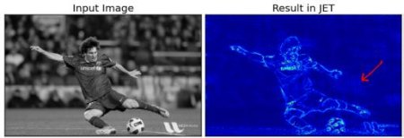
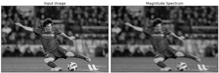
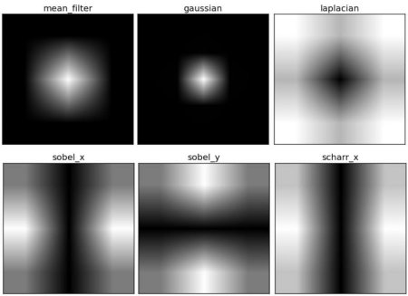

# OpenCV 中的图像转换
此章节文档只给出了傅里叶变换, 直接将其列出本问内
## [傅里叶变换](../../de/dbc/tutorial_py_fourier_transform.html)： 学习找到图像的傅里叶变换

### 目标
在本节中，我们将学习
* 使用OpenCV查找图像的傅立叶变换
* 利用Numpy中可用的FFT功能
* 傅立叶变换的一些应用
* 我们将看到以下函数：**[cv.dft()](https://docs.opencv.org/4.0.0/d2/de8/group__core__array.html#gadd6cf9baf2b8b704a11b5f04aaf4f39d)** ，**[cv.idft()](https://docs.opencv.org/4.0.0/d2/de8/group__core__array.html#gaa708aa2d2e57a508f968eb0f69aa5ff1)** 等

### 理论
傅立叶变换用于分析各种滤波器的频率特性。对于图像，使用 **2D离散傅里叶变换（DFT）** 查找频域。快速算法称为 **快速傅立叶变换（FFT）** 用于计算DFT。关于这些的详细信息可以在任何图像处理或信号处理教科书中找到。请参阅其他资源_部分。

对于正弦信号，$x(t)=Asin(2\pi ft)$ ，我们可以说 $f$ 是信号的频率，如果采用其频域，我们可以在 $f$ 处看到一个尖峰。如果信号进行采样，以形成离散信号，我们得到了相同的频域，但在范围周期性 $[-π，π]$ 或 $[0,2\pi]$（或 $[0,N]$ 用于N点DFT）。您可以将图像视为在两个方向上采样的信号。因此，在X和Y方向都进行傅立叶变换，可以得到图像的频率表示。

更直观地说，对于正弦信号，如果振幅在短时间内变化如此之快，则可以说它是高频信号。如果变化缓慢，则为低频信号。您可以将相同的想法扩展到图像。图像中的振幅在哪里急剧变化？在边缘点或噪音。因此，可以说边缘和噪声是图像中的高频内容。如果幅度没有太大变化，则它是低频分量。（一些链接已添加到“其他资源”，其中通过示例直观地说明了频率变换）。

现在，我们将看到如何找到傅立叶变换。

#### Numpy中的傅立叶变换
首先，我们将看到如何使用Numpy查找傅立叶变换。Numpy具有FFT软件包来执行此操作。**np.fft.fft2()** 为我们提供了频率转换，它将是一个复杂的数组。它的第一个参数是输入图像，即灰度图像。第二个参数是可选的，它决定输出数组的大小。如果它大于输入图像的大小，则在计算FFT之前用零填充输入图像。如果小于输入图像，将裁切输入图像。如果未传递任何参数，则输出数组的大小将与输入的大小相同。

现在，一旦获得结果，零频率分量（DC分量）将位于左上角。如果要使其居中，则需要将结果偏移 $\frac{N}{2}$ 在两个方向上。只需通过函数 **np.fft.fftshift()** 即可完成。（它更容易分析）。找到频率变换后，就可以找到幅度谱。

```python
import cv2 as cv
import numpy as np
from matplotlib import pyplot as plt
img = cv.imread('messi5.jpg',0)
f = np.fft.fft2(img)
fshift = np.fft.fftshift(f)
magnitude_spectrum = 20*np.log(np.abs(fshift))
plt.subplot(121),plt.imshow(img, cmap = 'gray')
plt.title('Input Image'), plt.xticks([]), plt.yticks([])
plt.subplot(122),plt.imshow(magnitude_spectrum, cmap = 'gray')
plt.title('Magnitude Spectrum'), plt.xticks([]), plt.yticks([])
plt.show()
```
结果如下：


看，您可以在中心看到更多白色区域，这表明低频内容更多。

因此，您已经进行了频率变换，您可以在频域中执行一些操作，例如高通滤波和重建图像，若进行逆DFT。为此，您需用尺寸为60x60的矩形窗口遮罩来消除低频。然后，使用 **np.fft.ifftshift()** 应用反向移位，以使DC分量再次出现在左上角。然后使用 **np.ifft2()** 函数找到逆FFT 。同样，结果将是一个复数。您可以采用其绝对值来进行
```python
rows, cols = img.shape
crow,ccol = rows//2 , cols//2
fshift[crow-30:crow+31, ccol-30:ccol+31] = 0
f_ishift = np.fft.ifftshift(fshift)
img_back = np.fft.ifft2(f_ishift)
img_back = np.real(img_back)
plt.subplot(131),plt.imshow(img, cmap = 'gray')
plt.title('Input Image'), plt.xticks([]), plt.yticks([])
plt.subplot(132),plt.imshow(img_back, cmap = 'gray')
plt.title('Image after HPF'), plt.xticks([]), plt.yticks([])
plt.subplot(133),plt.imshow(img_back)
plt.title('Result in JET'), plt.xticks([]), plt.yticks([])
plt.show()
```
结果如下：



结果表明高通滤波是边缘检测操作。这就是我们在“图像渐变”一章中看到的。这也表明大多数图像数据都存在于频谱的低频区域。无论如何，我们已经看到了如何在Numpy中找到DFT，IDFT等。现在，让我们看看如何在OpenCV中进行操作。

如果您仔细观察结果，尤其是最后一张JET颜色的图像，您会看到一些伪像（我用红色箭头标记的一个实例）。它在那里显示出一些波纹状结构，称为 **振铃效应** 。这是由我们用于遮罩的矩形窗口引起的。此蒙版转换为正弦形状，从而导致此问题。因此，矩形窗口不用于过滤。更好的选择是高斯窗口。

#### OpenCV中的傅立叶变换
OpenCV 为此提供了功能 **[cv.dft()](https://docs.opencv.org/4.0.0/d2/de8/group__core__array.html#gadd6cf9baf2b8b704a11b5f04aaf4f39d)** 和 **[cv.idft()](https://docs.opencv.org/4.0.0/d2/de8/group__core__array.html#gaa708aa2d2e57a508f968eb0f69aa5ff1)** 。它返回与以前相同的结果，但是有两个通道。第一个通道将具有结果的实部，第二个通道将具有结果的虚部。输入的图像应首先转换为**np.float32** 。我们将看到如何做。

```python
import numpy as np
import cv2 as cv
from matplotlib import pyplot as plt
img = cv.imread('messi5.jpg',0)
dft = cv.dft(np.float32(img),flags = cv.DFT_COMPLEX_OUTPUT)
dft_shift = np.fft.fftshift(dft)
magnitude_spectrum = 20*np.log(cv.magnitude(dft_shift[:,:,0],dft_shift[:,:,1]))
plt.subplot(121),plt.imshow(img, cmap = 'gray')
plt.title('Input Image'), plt.xticks([]), plt.yticks([])
plt.subplot(122),plt.imshow(magnitude_spectrum, cmap = 'gray')
plt.title('Magnitude Spectrum'), plt.xticks([]), plt.yticks([])
plt.show()
```
> **注意**
> 您还可以使用 **[cv.cartToPolar()](https://docs.opencv.org/4.0.0/d2/de8/group__core__array.html#gac5f92f48ec32cacf5275969c33ee837d)** 一次返回大小和相位

因此，现在我们必须进行逆DFT。在上一部分中，我们创建了一个HPF，这次我们将看到如何去除图像中的高频内容，即我们将LPF应用于图像。实际上会使图像模糊。为此，我们首先创建一个在低频时具有高值（1）的蒙版，即，我们传递LF含量，并在HF区域传递0。

```python
rows, cols = img.shape
crow,ccol = rows/2 , cols/2
# create a mask first, center square is 1, remaining all zeros
mask = np.zeros((rows,cols,2),np.uint8)
mask[crow-30:crow+30, ccol-30:ccol+30] = 1
# apply mask and inverse DFT
fshift = dft_shift*mask
f_ishift = np.fft.ifftshift(fshift)
img_back = cv.idft(f_ishift)
img_back = cv.magnitude(img_back[:,:,0],img_back[:,:,1])
plt.subplot(121),plt.imshow(img, cmap = 'gray')
plt.title('Input Image'), plt.xticks([]), plt.yticks([])
plt.subplot(122),plt.imshow(img_back, cmap = 'gray')
plt.title('Magnitude Spectrum'), plt.xticks([]), plt.yticks([])
plt.show()
```
查看结果：



> **注意**
> 像往常一样，OpenCV函数 **[cv.dft()](https://docs.opencv.org/4.0.0/d2/de8/group__core__array.html#gadd6cf9baf2b8b704a11b5f04aaf4f39d)** 和 **[cv.idft()](https://docs.opencv.org/4.0.0/d2/de8/group__core__array.html#gaa708aa2d2e57a508f968eb0f69aa5ff1)**  比Numpy对应函数要快。但是Numpy功能更加人性化。有关性能问题的更多详细信息，请参阅以下部分。

#### DFT的性能优化
对于某些阵列大小，DFT计算的性能更好。当阵列大小为2的幂时，它是最快的。大小为2、3和5的乘积的数组也得到了有效处理。因此，如果您担心代码的性能，可以在找到DFT之前将数组的大小修改为任何最佳大小（通过填充零）。对于OpenCV，您必须手动填充零。但是对于Numpy，您可以指定FFT计算的新大小，它将自动为您填充零。

那么我们如何找到这个最佳尺寸呢？OpenCV 为此提供了一个函数 **[cv.getOptimalDFTSize()](https://docs.opencv.org/4.0.0/d2/de8/group__core__array.html#ga6577a2e59968936ae02eb2edde5de299)** 。它适用于 **[cv.dft()](https://docs.opencv.org/4.0.0/d2/de8/group__core__array.html#gadd6cf9baf2b8b704a11b5f04aaf4f39d)** 和 **np.fft.fft2()** 。让我们使用IPython magic命令timeit检查它们的性能。

```python
In [16]: img = cv.imread('messi5.jpg',0)
In [17]: rows,cols = img.shape
In [18]: print("{} {}".format(rows,cols))
342 548
In [19]: nrows = cv.getOptimalDFTSize(rows)
In [20]: ncols = cv.getOptimalDFTSize(cols)
In [21]: print("{} {}".format(nrows,ncols))
360 576
```

参见，将大小（342,548）修改为（360，576）。现在让我们用零填充（对于OpenCV），并找到其DFT计算性能。您可以通过创建一个新的大零数组并将数据复制到其中来完成此操作，或者使用 **[cv.copyMakeBorder()](https://docs.opencv.org/4.0.0/d2/de8/group__core__array.html#ga2ac1049c2c3dd25c2b41bffe17658a36)** 。

```python
nimg = np.zeros((nrows,ncols))
nimg[:rows,:cols] = img
```
要么：
```python
right = ncols - cols
bottom = nrows - rows
bordertype = cv.BORDER_CONSTANT #just to avoid line breakup in PDF file
nimg = cv.copyMakeBorder(img,0,bottom,0,right,bordertype, value = 0)
```
现在，我们计算Numpy函数的DFT性能比较：
```python
In [22]: %timeit fft1 = np.fft.fft2(img)
10 loops, best of 3: 40.9 ms per loop
In [23]: %timeit fft2 = np.fft.fft2(img,[nrows,ncols])
100 loops, best of 3: 10.4 ms per loop
```
它显示了4倍的加速。现在，我们将尝试使用OpenCV函数。

```python
In [24]: %timeit dft1= cv.dft(np.float32(img),flags=cv.DFT_COMPLEX_OUTPUT)
100 loops, best of 3: 13.5 ms per loop
In [27]: %timeit dft2= cv.dft(np.float32(nimg),flags=cv.DFT_COMPLEX_OUTPUT)
100 loops, best of 3: 3.11 ms per loop
```
它还显示了4倍的加速。您还可以看到OpenCV函数比Numpy函数快3倍左右。也可以对逆FFT进行测试，这留给您练习。

#### 为什么拉普拉斯算子是高通滤波器？
在论坛上提出了类似的问题。问题是，为什么拉普拉斯算子是高通滤波器？为什么Sobel是HPF？等等。第一个得到的答案是傅里叶变换。只需对Laplacian进行傅立叶变换，以获得更大的FFT大小。分析一下：

```python
import cv2 as cv
import numpy as np
from matplotlib import pyplot as plt
# simple averaging filter without scaling parameter
mean_filter = np.ones((3,3))
# creating a gaussian filter
x = cv.getGaussianKernel(5,10)
gaussian = x*x.T
# different edge detecting filters
# scharr in x-direction
scharr = np.array([[-3, 0, 3],
                   [-10,0,10],
                   [-3, 0, 3]])
# sobel in x direction
sobel_x= np.array([[-1, 0, 1],
                   [-2, 0, 2],
                   [-1, 0, 1]])
# sobel in y direction
sobel_y= np.array([[-1,-2,-1],
                   [0, 0, 0],
                   [1, 2, 1]])
# laplacian
laplacian=np.array([[0, 1, 0],
                    [1,-4, 1],
                    [0, 1, 0]])
filters = [mean_filter, gaussian, laplacian, sobel_x, sobel_y, scharr]
filter_name = ['mean_filter', 'gaussian','laplacian', 'sobel_x', \
                'sobel_y', 'scharr_x']
fft_filters = [np.fft.fft2(x) for x in filters]
fft_shift = [np.fft.fftshift(y) for y in fft_filters]
mag_spectrum = [np.log(np.abs(z)+1) for z in fft_shift]
for i in xrange(6):
    plt.subplot(2,3,i+1),plt.imshow(mag_spectrum[i],cmap = 'gray')
    plt.title(filter_name[i]), plt.xticks([]), plt.yticks([])
plt.show()
```
查看结果：




从图像中，您可以看到每个内核阻止的频率区域以及它经过的区域。从这些信息中，我们可以说出为什么每个内核都是HPF或LPF

### 其他资源
[史蒂文·雷哈尔（Steven Lehar）对傅立叶理论的直观解释](http://cns-alumni.bu.edu/~slehar/fourier/fourier.html)
[HIPR的傅立叶变换](http://homepages.inf.ed.ac.uk/rbf/HIPR2/fourier.htm)
[对于图像，频域表示什么？](http://dsp.stackexchange.com/q/1637/818)

