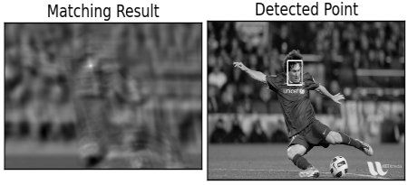
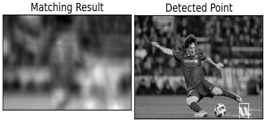
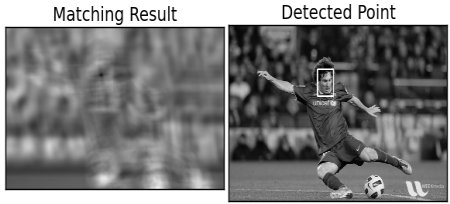
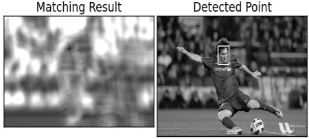

# 模板匹配

## 目标

在本章中，您将学习

*   使用模板匹配查找图像中的对象
*   您将了解这些函数： **[cv.matchTemplate（）](../../df/dfb/group__imgproc__object.html#ga586ebfb0a7fb604b35a23d85391329be "Compares a template against overlapped image regions. ")** ， **[cv.minMaxLoc（）](../../d2/de8/group__core__array.html#gab473bf2eb6d14ff97e89b355dac20707 "Finds the global minimum and maximum in an array. ")**

## 理论

模板匹配是一种在较大图像中搜索和查找模板图像位置的方法。为此，OpenCV 带有一个函数 **[cv.matchTemplate（）](../../df/dfb/group__imgproc__object.html#ga586ebfb0a7fb604b35a23d85391329be "Compares a template against overlapped image regions. ")** 。它只是在输入图像上滑动模板图像（如在 2D 卷积中），并比较模板图像下的模板和输入图像的补丁。在 OpenCV 中实现了几种比较方法。 （您可以查看文档以获取更多详细信息）。它返回一个灰度图像，其中每个像素表示该像素的邻域与模板匹配的程度。

如果输入图像的大小（WxH）且模板图像的大小（wxh），则输出图像的大小为（W-w + 1，H-h + 1）。得到结果后，可以使用 **[cv.minMaxLoc（）](../../d2/de8/group__core__array.html#gab473bf2eb6d14ff97e89b355dac20707 "Finds the global minimum and maximum in an array. ")** 函数查找最大/最小值的位置。将其作为矩形的左上角，取（w，h）作为矩形的宽度和高度。那个矩形是你的模板区域。

Note

如果你使用[cv.TM_SQDIFF](../../df/dfb/group__imgproc__object.html#gga3a7850640f1fe1f58fe91a2d7583695dab65c042ed62c9e9e095a1e7e41fe2773 " ")函数作为比较的方法, 最小值作为匹配值。

## OpenCV 中的模板匹配

在这里，作为一个例子，我们将在梅西的照片中搜索他的面部，因此我创建了一个如下的模板：


我们将尝试所有的比较方法，看看它们的结果如何：

```python
import cv2 as cv
import numpy as np
from matplotlib import pyplot as plt
img = cv.imread('messi5.jpg',0)
img2 = img.copy()
template = cv.imread('template.jpg',0)
w, h = template.shape[::-1]
# All the 6 methods for comparison in a list
methods = ['cv.TM_CCOEFF', 'cv.TM_CCOEFF_NORMED', 'cv.TM_CCORR',
            'cv.TM_CCORR_NORMED', 'cv.TM_SQDIFF', 'cv.TM_SQDIFF_NORMED']
for meth in methods:
    img = img2.copy()
    method = eval(meth)
    # Apply template Matching
    res = cv.matchTemplate(img,template,method)
    min_val, max_val, min_loc, max_loc = cv.minMaxLoc(res)
    # If the method is TM_SQDIFF or TM_SQDIFF_NORMED, take minimum
    if method in [cv.TM_SQDIFF, cv.TM_SQDIFF_NORMED]:
        top_left = min_loc
    else:
        top_left = max_loc
    bottom_right = (top_left[0] + w, top_left[1] + h)
    cv.rectangle(img,top_left, bottom_right, 255, 2)
    plt.subplot(121),plt.imshow(res,cmap = 'gray')
    plt.title('Matching Result'), plt.xticks([]), plt.yticks([])
    plt.subplot(122),plt.imshow(img,cmap = 'gray')
    plt.title('Detected Point'), plt.xticks([]), plt.yticks([])
    plt.suptitle(meth)
    plt.show()
```

请参阅以下结果：

*   [cv.TM_CCOEFF](../../df/dfb/group__imgproc__object.html#gga3a7850640f1fe1f58fe91a2d7583695dac5babb7dfda59544e3e31ea928f8cb16)



*   [cv.TM_CCOEFF_NORMED](../../df/dfb/group__imgproc__object.html#gga3a7850640f1fe1f58fe91a2d7583695dac6677e2af5e0fae82cc5339bfaef5038 " ")


*   [cv.TM_CCORR](../../df/dfb/group__imgproc__object.html#gga3a7850640f1fe1f58fe91a2d7583695da5be00b45a4d99b5e42625b4400bfde65 " ")



*   [cv.TM_CCORR_NORMED](../../df/dfb/group__imgproc__object.html#gga3a7850640f1fe1f58fe91a2d7583695daf9c3ab9296f597ea71f056399a5831da " ")


*   [cv.TM_SQDIFF](../../df/dfb/group__imgproc__object.html#gga3a7850640f1fe1f58fe91a2d7583695dab65c042ed62c9e9e095a1e7e41fe2773 " ")



*   [cv.TM_SQDIFF_NORMED](../../df/dfb/group__imgproc__object.html#gga3a7850640f1fe1f58fe91a2d7583695da5382c8f9df87e87cf1e9f9927dc3bc31 " ")



你可以看到使用 **[cv.TM_CCORR](../../df/dfb/group__imgproc__object.html#gga3a7850640f1fe1f58fe91a2d7583695da5be00b45a4d99b5e42625b4400bfde65 " ")**的结果并不像我们预期的那样好。

## 模板与多个对象匹配

在上一节中，我们搜索了梅西的脸部图像，该图像仅在图中出现一次。假设您正在搜索的对象在图中出现了多次， **[cv.minMaxLoc（）](../../d2/de8/group__core__array.html#gab473bf2eb6d14ff97e89b355dac20707 "Finds the global minimum and maximum in an array. ")** 将不会为你提供所有的匹配点。在这种情况下，我们将使用阈值。所以在这个例子中，我们将使用着名游戏 **Mario** 的截图，并在其中找到硬币。

```python
import cv2 as cv
import numpy as np
from matplotlib import pyplot as plt
img_rgb = cv.imread('mario.png')
img_gray = cv.cvtColor(img_rgb, cv.COLOR_BGR2GRAY)
template = cv.imread('mario_coin.png',0)
w, h = template.shape[::-1]
res = cv.matchTemplate(img_gray,template,cv.TM_CCOEFF_NORMED)
threshold = 0.8
loc = np.where( res >= threshold)
for pt in zip(*loc[::-1]):
    cv.rectangle(img_rgb, pt, (pt[0] + w, pt[1] + h), (0,0,255), 2)
cv.imwrite('res.png',img_rgb)
```

结果：


## 其他资源

## 练习
