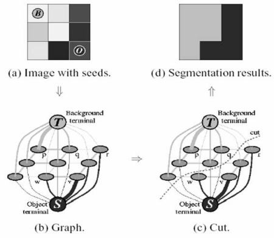

# 基于 GrabCut 算法的交互式前景提取

## 目标

在这一章当中

*   我们将看到 GrabCut 算法来提取图像中的前景
*   我们将为此创建一个交互式应用程序。

## 理论

GrabCut 算法由 Carsten Rother，Vladimir Kolmogorov＆amp;来自英国剑桥微软研究院的 Andrew Blake。在他们的论文中，[“GrabCut”：使用迭代图切割](http://dl.acm.org/citation.cfm?id=1015720)中提出来的。该算法需要最小的人工交互来做前景提取，这个算法被称为 GrabCut。

从用户的角度来看，该算法是如何工作的呢？最初用户在前景区域周围绘制一个矩形(该矩形需要完全框住所有的前景区域) 。然后算法对其进行迭代分割，得到最佳结果。但在某些情况下，分割的不是那么理想，比如说，它可能把一些前景区域标成了背景，或者反过来。如果发生了这样的情况，用户需要进行仔细的修正。只要在有错误结果的地方“划一下”就行了。“划一下”基本上的意思就是说，*"嘿，这个区域应该是前景，你标记它为背景，在下一次迭代中更正它。"* 或者对背景来说，反过来。然后再下一次迭代中，你就会得到更好的结果

见下图。第一名球员和足球被包围在一个蓝色矩形中。然后进行一些具有白色笔划（表示前景）和黑色笔划（表示背景）的最终修饰。我们得到了一个很好的结果。


那背景会发生什么？

*   用户输入矩形。这个矩形之外的所有东西都将被视为确定的背景（这就是之前提到的矩形应该包括所有对象的原因）。矩形内的一切都是未知的。类似地，任何指定前景和背景的用户输入都被视为硬标签，这意味着它们不会在过程中发生变化。
*   计算机根据我们提供的数据进行初始标记。它标记前景和背景像素（或硬标记）
*   现在使用高斯混合模型（GMM）来模拟前景和背景。
*   根据我们提供的数据，GMM 学习并创建新的像素分布。也就是说，未知像素被标记为可能的前景或可能的背景，这取决于其在颜色统计方面与其他硬标记像素的关系（它就像聚类一样）。
*   从该像素分布构建图形。图中的节点是像素。添加了另外两个节点，**源节点**和 **Sink 节点**。每个前景像素都连接到源节点，每个背景像素都连接到 Sink 节点。
*   连接像素到源节点/端节点的边的权重由像素是前景/背景的概率来定义。像素之间的权重由边缘信息或像素相似性定义。如果像素颜色存在较大差异，则它们之间的边缘将获得较低的权重。
*   然后使用 mincut 算法来分割图形。它将图形切割成两个分离源节点和汇聚节点，具有最小的成本函数。成本函数是被切割边缘的所有权重的总和。切割后，连接到 Source 节点的所有像素变为前景，连接到 Sink 节点的像素变为背景。
*   该过程一直持续到分类收敛为止。

如下图所示（图片提供： [http://www.cs.ru.ac.za/research/g02m1682/](http://www.cs.ru.ac.za/research/g02m1682/) ）



## 演示

现在我们使用 OpenCV 进行抓取算法。 OpenCV 具有此功能， **[cv.grabCut（）](../../d7/d1b/group__imgproc__misc.html#ga909c1dda50efcbeaa3ce126be862b37f "Runs the GrabCut algorithm. ")** 。我们将首先看到它的参数：

*   _img_ - 输入图像
*   _mask_ - 这是一个掩码图像，我们指定哪些区域是背景，前景或可能的背景/前景等。它由以下标志完成， **[cv.GC_BGD](../../d7/d1b/group__imgproc__misc.html#ggad43d3e4208d3cf025d8304156b02ba38a889f1ce109543e8aed80a7abbc6dcb39 "an obvious background pixels ") ， [cv.GC_FGD](../../d7/d1b/group__imgproc__misc.html#ggad43d3e4208d3cf025d8304156b02ba38a4757c1f0587bcf6e53e86dee7689a649 "an obvious foreground (object) pixel ") ， [cv.GC_PR_BGD](../../d7/d1b/group__imgproc__misc.html#ggad43d3e4208d3cf025d8304156b02ba38af748414821c7f39fab3493f9eed1eedf "a possible background pixel ") ， [cv.GC_PR_FGD](../../d7/d1b/group__imgproc__misc.html#ggad43d3e4208d3cf025d8304156b02ba38ad33184b73cb87e08d29e0a3411b7c863 "a possible foreground pixel ")**，或简单地将 0,1,2,3 传递给图像。
*   _rect_ - 它是一个矩形的坐标，包括格式为（x，y，w，h）的前景对象
*   _bdgModel_ ， _fgdModel_ - 这些是内部算法使用的数组。您只需创建两个大小为（n = 1.65）的 np.float64 类型零数组。
*   _iterCount_ - 算法运行的迭代次数。
*   _ 模式 _ - 它应该是 **[cv.GC_INIT_WITH_RECT](../../d7/d1b/group__imgproc__misc.html#ggaf8b5832ba85e59fc7a98a2afd034e558a5f8853c1e5a89c4aa2687d1f78a7e550)**或 **[cv.GC_INIT_WITH_MASK](../../d7/d1b/group__imgproc__misc.html#ggaf8b5832ba85e59fc7a98a2afd034e558ab01527c7effb50fd1c54d8c4e671ed22)**或合并后决定我们是否正在绘图矩形或最终修饰笔画。

首先让我们看看矩形模式。我们加载图像，创建一个类似的蒙版图像。我们创建 _fgdModel_ 和 _bgdModel_ 。我们给出矩形参数。这一切都是直截了当的。让算法运行 5 次迭代。模式应该是 _[cv.GC_INIT_WITH_RECT](../../d7/d1b/group__imgproc__misc.html#ggaf8b5832ba85e59fc7a98a2afd034e558a5f8853c1e5a89c4aa2687d1f78a7e550)_，因为我们使用的是矩形。然后运行抓取。它修改了蒙版图像。在新的掩模图像中，像素将标记有四个标记，表示背景/前景，如上所述。因此，我们修改掩模，使得所有 0 像素和 2 像素都被置为 0（即背景），并且所有 1 像素和 3 像素被置为 1（即前景像素）。现在我们的最后面具准备好了。只需将其与输入图像相乘即可得到分割后的图像。

```python
import numpy as np
import cv2 as cv
from matplotlib import pyplot as plt
img = cv.imread('messi5.jpg')
mask = np.zeros(img.shape[:2],np.uint8)
bgdModel = np.zeros((1,65),np.float64)
fgdModel = np.zeros((1,65),np.float64)
rect = (50,50,450,290)
cv.grabCut(img,mask,rect,bgdModel,fgdModel,5,cv.GC_INIT_WITH_RECT)
mask2 = np.where((mask==2)|(mask==0),0,1).astype('uint8')
img = img*mask2[:,:,np.newaxis]
plt.imshow(img),plt.colorbar(),plt.show()
```

结果如下：


哎呀，梅西的头发都没了。 _ 谁没有他的头发喜欢梅西？_ 我们需要把它带回来。所以我们将用 1 像素（确定的前景）给出一个精细的修饰。与此同时，有些地方已经出现了我们不想要的图片，还有一些标识。我们需要删除它们。在那里我们提供一些 0 像素的修饰（确定背景）。因此，正如我们现在所说的那样，我们在前一种情

_ 我实际上做的是，我在绘画应用程序中打开了输入图像，并在图像中添加了另一层。在画中使用画笔工具，我在这个新图层上标记了带有黑色的白色和不需要的背景（如徽标，地面等）的前景（头发，鞋子，球等）。然后用灰色填充剩余的背景。然后在 OpenCV 中加载该掩模图像，编辑我们在新添加的掩模图像中使用相应值的原始掩模图像。检查以下代码：_

```python
# newmask is the mask image I manually labelled
newmask = cv.imread('newmask.png',0)
# wherever it is marked white (sure foreground), change mask=1
# wherever it is marked black (sure background), change mask=0
mask[newmask == 0] = 0
mask[newmask == 255] = 1
mask, bgdModel, fgdModel = cv.grabCut(img,mask,None,bgdModel,fgdModel,5,cv.GC_INIT_WITH_MASK)
mask = np.where((mask==2)|(mask==0),0,1).astype('uint8')
img = img*mask[:,:,np.newaxis]
plt.imshow(img),plt.colorbar(),plt.show()
```

看下面的结果：


就是这样了。这里不是在 rect 模式下初始化，而是直接进入掩码模式。只需用 2 像素或 3 像素（可能的背景/前景）标记蒙版图像中的矩形区域。然后像我们在第二个例子中那样用 1 像素标记我们的 sure_foreground。然后直接应用具有掩码模式的 grabCut 函数。

## 其他资源

## 练习

1.  OpenCV 示例包含一个示例 grabcut.py，它是一个使用 grabcut 的交互式工具。核实。另请观看 [youtube 视频](http://www.youtube.com/watch?v=kAwxLTDDAwU)如何使用它。
2.  在这里，您可以将其制作成交互式样本，使用鼠标绘制矩形和笔划，创建轨迹栏以调整笔划宽度等。
