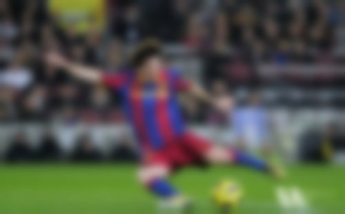
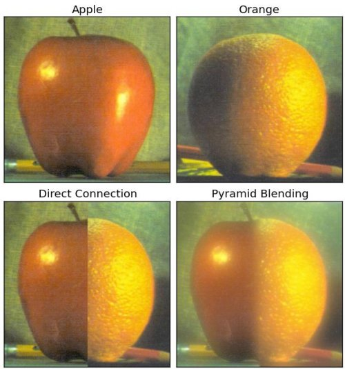

# 图像金字塔

## 目标

在这一章当中，

*   我们将了解图像金字塔。
*   我们将使用图像金字塔创建一个新的水果，“Orapple”
*   我们将看到这些功能： **[cv.pyrUp（）](../../d4/d86/group__imgproc__filter.html#gada75b59bdaaca411ed6fee10085eb784 "Upsamples an image and then blurs it. ")** ， **[cv.pyrDown（）](../../d4/d86/group__imgproc__filter.html#gaf9bba239dfca11654cb7f50f889fc2ff "Blurs an image and downsamples it. ")**

## 理论

在通常情况下我们使用大小恒定的图像。但在某些情况下，我们需要使用同一副图像的不同分辨率的部分。例如，在搜索图像中的某些内容时，如脸部信息，并不确定该对象在所述图像中的大小。在这种情况下，我们需要创建一组具有不同分辨率的相同图像，并在所有图像中搜索对象。这些具有不同分辨率的图像被称为**图像金字塔**（因为当它们保持在堆叠中，底部具有最高分辨率图像而顶部具有最低分辨率图像时，它看起来像金字塔）。

图像金字塔有两种。 1）**高斯金字塔**和 2）**拉普拉斯金字塔**

通过去除较低级别（较高分辨率）图像中的连续行和列来形成高斯金字塔中的较高级别（低分辨率）。然后，较高级别的每个像素由来自基础级别中的 5 个像素的贡献形成，具有高斯权重。通过这样做，<a href="https://www.codecogs.com/eqnedit.php?latex=M&space;\times&space;N" target="_blank"></a>图像变为<a href="https://www.codecogs.com/eqnedit.php?latex=\frac{M}{2}&space;\times&space;\frac{N}{2}" target="_blank"></a>图像。因此面积减少到原始面积的四分之一。它被称为 Octave。当我们在金字塔中上升时（即分辨率降低），相同的模式继续。同样，在扩展时，每个级别的区域变为 4 次。我们可以使用 **[cv.pyrDown（）](../../d4/d86/group__imgproc__filter.html#gaf9bba239dfca11654cb7f50f889fc2ff "Blurs an image and downsamples it. ")** 和 **[cv.pyrUp（）](../../d4/d86/group__imgproc__filter.html#gada75b59bdaaca411ed6fee10085eb784 "Upsamples an image and then blurs it. ")** 函数找到高斯金字塔。

```python
img = cv.imread('messi5.jpg')lower_reso = cv.pyrDown(higher_reso)
```

以下是图像金字塔中的 4 个级别。


现在你可以用 **[cv.pyrUp（）](../../d4/d86/group__imgproc__filter.html#gada75b59bdaaca411ed6fee10085eb784 "Upsamples an image and then blurs it. ")** 函数处理图像金字塔。

```python
higher_reso2 = cv.pyrUp(lower_reso)
```

请记住，`higher_reso2`不等于`higher_reso`，因为一旦降低了分辨率，就会丢失信息。下图是从前一种情况下的最小图像创建的金字塔下 3 级。将其与原始图像进行比较：



拉普拉斯金字塔由高斯金字塔形成。没有专属功能。拉普拉斯金字塔图像仅与边缘图像相似。它的大部分元素都是零。它们用于图像压缩。拉普拉斯金字塔中的一个层次由高斯金字塔中的该层次与高斯金字塔中的上层的扩展版本之间的差异形成。拉普拉斯级别的三个级别如下所示（调整对比度以增强内容）：


## 使用金字塔的图像混合

金字塔的一个应用是图像混合。例如，在图像拼接中，您需要将两个图像堆叠在一起，但由于图像之间的不连续性，它可能看起来不太好。在这种情况下，使用金字塔进行图像混合可以实现无缝混合，而不会在图像中留下太多数据。其中一个典型的例子是混合了两种水果，橙子和苹果。现在查看结果以了解我在说什么：



请在其他资源中查看第一个参考资料，它有关于图像混合，拉普拉斯金字塔等的完整图表细节。简单的表述如下：

1.  加载苹果和橙色的两个图像
2.  找到苹果和橙色的高斯金字塔（在这个例子中，级别数是 6）
3.  从高斯金字塔，找到他们的拉普拉斯金字塔
4.  现在加入左半部分的苹果和右半部分的拉普拉斯金字塔
5.  最后，从这个联合图像金字塔，重建原始图像。

以下是完整的代码。 （为简单起见，每个步骤都单独完成，由此可能需要更多内存。读者也可以对其进行优化）。

```python
import cv2 as cv
import numpy as np,sys
A = cv.imread('apple.jpg')
B = cv.imread('orange.jpg')
# generate Gaussian pyramid for A
G = A.copy()
gpA = [G]
for i in xrange(6):
    G = cv.pyrDown(G)
    gpA.append(G)
# generate Gaussian pyramid for B
G = B.copy()
gpB = [G]
for i in xrange(6):
    G = cv.pyrDown(G)
    gpB.append(G)
# generate Laplacian Pyramid for A
lpA = [gpA[5]]
for i in xrange(5,0,-1):
    GE = cv.pyrUp(gpA[i])
    L = cv.subtract(gpA[i-1],GE)
    lpA.append(L)
# generate Laplacian Pyramid for B
lpB = [gpB[5]]
for i in xrange(5,0,-1):
    GE = cv.pyrUp(gpB[i])
    L = cv.subtract(gpB[i-1],GE)
    lpB.append(L)
# Now add left and right halves of images in each level
LS = []
for la,lb in zip(lpA,lpB):
    rows,cols,dpt = la.shape
    ls = np.hstack((la[:,0:cols/2], lb[:,cols/2:]))
    LS.append(ls)
# now reconstruct
ls_ = LS[0]
for i in xrange(1,6):
    ls_ = cv.pyrUp(ls_)
    ls_ = cv.add(ls_, LS[i])
# image with direct connecting each half
real = np.hstack((A[:,:cols/2],B[:,cols/2:]))
cv.imwrite('Pyramid_blending2.jpg',ls_)
cv.imwrite('Direct_blending.jpg',real)
```

## 其他资源

1.  [图像混合](http://pages.cs.wisc.edu/~csverma/CS766_09/ImageMosaic/imagemosaic.html)

## 练习
