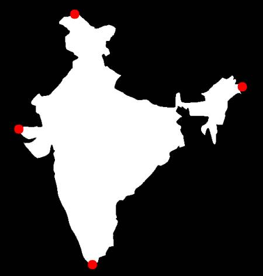
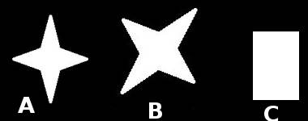
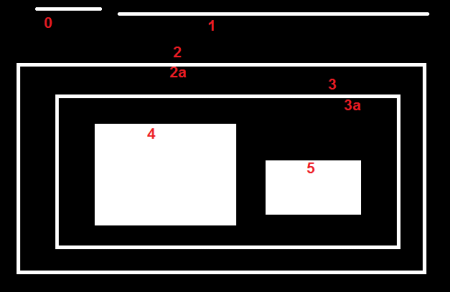

# OpenCV 中的轮廓
此章节在Opencv 文档中 属于大章节, 有细分章节,为了不调整结构, 将章节内容全部加入此章节内容中
## [轮廓：入门](../../d4/d73/tutorial_py_contours_begin.html)
学习查找和绘制轮廓

### 目标
* 了解轮廓是什么。
* 学习寻找轮廓，绘制轮廓等
* 您将看到以下功能：**[cv.findContours()](https://docs.opencv.org/4.0.0/d3/dc0/group__imgproc__shape.html#gadf1ad6a0b82947fa1fe3c3d497f260e0 "Find contours in a binary image")** ，**[cv.drawContours()](https://docs.opencv.org/4.0.0/d6/d6e/group__imgproc__draw.html#ga746c0625f1781f1ffc9056259103edbc "Draw contours outlines or filled contours.")**
### 什么是轮廓？
轮廓可以简单地解释为连接具有相同颜色或强度的所有连续点(沿边界)的曲线。轮廓是用于形状分析以及对象检测和识别的有用工具。
* 为了获得更高的准确性，请使用二进制图像。因此，在找到轮廓之前，请应用阈值或 **Canny** 边缘检测。
* 从OpenCV 3.2开始，**[findContours()](https://docs.opencv.org/4.0.0/d3/dc0/group__imgproc__shape.html#gadf1ad6a0b82947fa1fe3c3d497f260e0 "Find contours in a binary image")** 不再修改源图像。
* 在OpenCV中，找到轮廓就像从黑色背景中找到白色物体。因此请记住，要找到的对象应该是白色，背景应该是黑色。

让我们看看如何找到二进制图像的轮廓：

```python
import numpy as np
import cv2 as cv
im = cv.imread('test.jpg')
imgray = cv.cvtColor(im, cv.COLOR_BGR2GRAY)
ret, thresh = cv.threshold(imgray, 127, 255, 0)
contours, hierarchy = cv.findContours(thresh, cv.RETR_TREE, cv.CHAIN_APPROX_SIMPLE)
```
看到，在 **[cv.findContours()](https://docs.opencv.org/4.0.0/d3/dc0/group__imgproc__shape.html#gadf1ad6a0b82947fa1fe3c3d497f260e0 "Find contours in a binary image")** 函数中有三个参数，第一个是源图像，第二个是轮廓检索模式，第三个是轮廓逼近方法。并输出轮廓和层次。轮廓是图像中所有轮廓的Python列表。每个单独的轮廓都是对象边界点的(x，y)坐标的Numpy数组。

> **注意**
> 稍后我们将详细讨论第二和第三论点以及有关层次结构。在此之前，代码示例中赋予它们的值将对所有图像都适用。

### 如何绘制轮廓？
要绘制轮廓，请使用 **[cv.drawContours()](https://docs.opencv.org/4.0.0/d6/d6e/group__imgproc__draw.html#ga746c0625f1781f1ffc9056259103edbc "Draw contours outlines or filled contours.")** 函数。只要有边界点，它也可以用来绘制任何形状。它的第一个参数是源图像，第二个参数是应该作为Python列表传递的轮廓，第三个参数是轮廓的索引(在绘制单个轮廓时很有用。要绘制所有轮廓，请传递-1)，其余参数是颜色，厚度等等

* 要在图像中绘制所有轮廓：
```python
cv.drawContours(img, contours, -1, (0,255,0), 3)
```
* 要绘制单个轮廓，请说第四个轮廓：
```python
cv.drawContours(img, contours, 3, (0,255,0), 3)
```
* 但是在大多数情况下，以下方法会很有用：
```python
cnt = contours[4]
cv.drawContours(img, [cnt], 0, (0,255,0), 3)
```
> **注意**
> 最后两种方法相同，但是前进时，您会发现最后一种更有用。

### 轮廓近似法
这是 **[cv.findContours()](https://docs.opencv.org/4.0.0/d3/dc0/group__imgproc__shape.html#gadf1ad6a0b82947fa1fe3c3d497f260e0 "Find contours in a binary image")** 函数中的第三个参数。它实际上表示什么？

上面我们告诉我们轮廓是强度相同的形状的边界。它存储形状边界的(x，y)坐标。但是它存储所有坐标吗？这是通过这种轮廓近似方法指定的。

如果传递 **[cv.CHAIN_APPROX_NONE](https://docs.opencv.org/4.0.0/d3/dc0/group__imgproc__shape.html#gga4303f45752694956374734a03c54d5ffaf7d9a3582d021d5dadcb0e37201a62f8)** ，则会存储所有边界点。但是实际上我们需要所有这些要点吗？例如，您找到了一条直线的轮廓。您是否需要线上的所有点来代表该线？不，我们只需要该线的两个端点即可。这就是 **[cv.CHAIN_APPROX_SIMPLE](https://docs.opencv.org/4.0.0/d3/dc0/group__imgproc__shape.html#gga4303f45752694956374734a03c54d5ffa5f2883048e654999209f88ba04c302f5)** 所做的。它删除所有冗余点并压缩轮廓，从而节省内存。

下面的矩形图像演示了此技术。只需在轮廓数组中的所有坐标上绘制一个圆(以蓝色绘制)。第一个图像显示点I与得到 **[cv.CHAIN_APPROX_NONE](https://docs.opencv.org/4.0.0/d3/dc0/group__imgproc__shape.html#gga4303f45752694956374734a03c54d5ffaf7d9a3582d021d5dadcb0e37201a62f8)** (734点)和第二图像显示了一个与 **[cv.CHAIN_APPROX_SIMPLE](https://docs.opencv.org/4.0.0/d3/dc0/group__imgproc__shape.html#gga4303f45752694956374734a03c54d5ffa5f2883048e654999209f88ba04c302f5)** (仅4个点)。看，它可以节省多少内存！！！


## [轮廓特征](../../dd/d49/tutorial_py_contour_features.html)
学习找到轮廓的不同特征，如区域，周长，边界矩形等。

### 目标
在本文中，我们将学习
* 查找轮廓的不同特征，例如面积，周长，质心，边界框等
* 您将看到大量与轮廓有关的功能。

### 1. 矩
图像矩可帮助您计算某些特征，例如物体的重心，物体的面积等。请查看“图像矩”上的[Wikipedia](http://en.wikipedia.org/wiki/Image_moment)页面

函数 **[cv.moments()](https://docs.opencv.org/4.0.0/d3/dc0/group__imgproc__shape.html#ga556a180f43cab22649c23ada36a8a139)** 提供了所有计算出的矩值的列表。见下文：
```python
import numpy as np
import cv2 as cv
img = cv.imread('star.jpg',0)
ret,thresh = cv.threshold(img,127,255,0)
contours,hierarchy = cv.findContours(thresh, 1, 2)
cnt = contours[0]
M = cv.moments(cnt)
print( M )
```

在图像矩中，您可以提取有用的数据，例如面积，质心等。质心由关系C给出 $C_x = \frac{M_{10}}{M_{00}}$ 和 $C_y = \frac{M_{01}}{M_{00}}$。可以按照以下步骤进行：

```python
cx = int(M['m10']/M['m00'])
cy = int(M['m01']/M['m00'])
```

### 2.轮廓面积
轮廓区域由函数 **[cv.contourArea()](https://docs.opencv.org/4.0.0/d3/dc0/group__imgproc__shape.html#ga2c759ed9f497d4a618048a2f56dc97f1)** 或从力矩 $M_{00}$中给出。
```python
area = cv.contourArea(cnt)
```
### 3.轮廓周长
也称为弧长。可以使用 **[cv.arcLength()](https://docs.opencv.org/4.0.0/d3/dc0/group__imgproc__shape.html#ga8d26483c636be6b35c3ec6335798a47c)** 函数找到它。第二个参数指定形状是闭合轮廓(如果通过True)还是曲线。

```python
perimeter = cv.arcLength(cnt,True)
```
### 4.轮廓近似
根据我们指定的精度，它可以将轮廓形状近似为顶点数量较少的其他形状。它是[Douglas-Peucker](http://en.wikipedia.org/wiki/Ramer-Douglas-Peucker_algorithm)算法的实现。检查维基百科页面上的算法和演示。

为了理解这一点，假设您试图在图像中找到一个正方形，但是由于图像中的某些问题，您没有得到一个完美的正方形，而是一个“坏形状”(如下图所示)。现在，您可以使用此功能来近似形状。在这种情况下，第二个参数称为epsilon，它是从轮廓到近似轮廓的最大距离。它是一个精度参数。需要正确选择 epsilon 才能获得正确的输出。
```python
epsilon = 0.1*cv.arcLength(cnt,True)
approx = cv.approxPolyDP(cnt,epsilon,True)
```
下面，在第二张图片中，绿线显示了 精度 epsilon = 10% 时的近似曲线。第三幅图显示了精度 epsilon  = 1% 时的情况。第三个参数指定曲线是否闭合。


### 5.凸包
凸包外观看起来与轮廓逼近相似，但并非如此(在某些情况下两者可能提供相同的结果)。在这里，**[cv.convexHull()](https://docs.opencv.org/4.0.0/d3/dc0/group__imgproc__shape.html#ga014b28e56cb8854c0de4a211cb2be656)** 函数检查曲线是否存在凸凹缺陷并对其进行校正。一般而言，凸曲线是始终凸出或至少平坦的曲线。如果在内部凸出，则称为凸度缺陷。例如，检查下面的手的图像。红线显示手的凸包。双向箭头标记显示凸度缺陷，这是船体与轮廓线之间的局部最大偏差。


关于它的语法，有一些事情需要讨论：

```python
hull = cv.convexHull(points[, hull[, clockwise[, returnPoints]]])
```
参数详细信息：

* points:  就是我们传入的轮廓。
* hull: 是输出，通常我们避免它。
* clockwise：方向标记。如果为True，则输出凸包为顺时针方向。否则，其方向为逆时针方向。
* returnPoints：默认情况下为True。然后返回船体点的坐标。如果为False，则返回与船体点相对应的轮廓点的索引。

因此，要获得如上图所示的凸包，以下内容就足够了：
```python
hull = cv.convexHull(cnt)
```
但是，如果要查找凸度缺陷，则需要传递 returnPoints = False。为了理解它，我们将拍摄上面的矩形图像。首先，我发现它的轮廓为cnt。现在，我发现它的带有returnPoints = True的凸包，得到以下值：[[[234 202]]，[[51 202]]，[[51 79]]，[[234 79]]]，它们是四个角矩形的点。现在，如果对returnPoints = False执行相同的操作，则会得到以下结果：[[129]，[67]，[0]，[142]]。这些是轮廓中相应点的索引。例如，检查第一个值：cnt [129] = [[234，202]]与第一个结果相同(对于其他结果依此类推)。

当我们讨论凸度缺陷时，您将再次看到它。

### 6.检查凸度

**[cv.isContourConvex()](https://docs.opencv.org/4.0.0/d3/dc0/group__imgproc__shape.html#ga8abf8010377b58cbc16db6734d92941b)** 是一个函数用来检查曲线是否为凸多边形。它只是返回True还是False。
```python
k = cv.isContourConvex(cnt)
```
### 7.边界矩形
有两种类型的边界矩形。
#### 7.a. 直角矩形
它是一个直角矩形，不考虑对象的旋转。因此，边界矩形的面积将不会最小。它可以通过函数 **[cv.boundingRect()](https://docs.opencv.org/4.0.0/d3/dc0/group__imgproc__shape.html#ga103fcbda2f540f3ef1c042d6a9b35ac7)** 找到。

令(x，y)为矩形的左上角坐标，而(w，h)为矩形的宽度和高度。

```python
x,y,w,h = cv.boundingRect(cnt)
cv.rectangle(img,(x,y),(x+w,y+h),(0,255,0),2)
```
#### 7.b．旋转矩形
在这里，边界矩形是用最小面积绘制的，因此它也考虑了旋转。使用的函数是 **[cv.minAreaRect()](https://docs.opencv.org/4.0.0/d3/dc0/group__imgproc__shape.html#ga3d476a3417130ae5154aea421ca7ead9)** 。它返回一个Box2D结构，其中包含以下细节-(中心(x，y)，(宽度，高度)，旋转角度)。但是要绘制此矩形，我们需要矩形的4个角。它是通过函数 **[cv.boxPoints()](https://docs.opencv.org/4.0.0/d3/dc0/group__imgproc__shape.html#gaf78d467e024b4d7936cf9397185d2f5c)** 获得的

```python
rect = cv.minAreaRect(cnt)
box = cv.boxPoints(rect)
box = np.int0(box)
cv.drawContours(img,[box],0,(0,0,255),2)
```
两个矩形都显示在单个图像中。绿色矩形显示法线边界矩形。红色矩形是旋转的矩形。


### 8.最小外圆
接下来，我们使用函数 **[cv.minEnclosingCircle()](https://docs.opencv.org/4.0.0/d3/dc0/group__imgproc__shape.html#ga8ce13c24081bbc7151e9326f412190f1)** 找到对象的外接圆。它是一个以最小面积完全覆盖对象的圆圈。

```python
(x,y),radius = cv.minEnclosingCircle(cnt)
center = (int(x),int(y))
radius = int(radius)
cv.circle(img,center,radius,(0,255,0),2)
```


### 9.拟合椭圆
下一步是使椭圆适合对象。它返回椭圆所在的旋转矩形。

```python
ellipse = cv.fitEllipse(cnt)
cv.ellipse(img,ellipse,(0,255,0),2)
```


### 10.拟合线
同样，我们可以将一条直线拟合到一组点。下图包含一组白点。我们可以近似一条直线。

```python
rows,cols = img.shape[:2]
[vx,vy,x,y] = cv.fitLine(cnt, cv.DIST_L2,0,0.01,0.01)
lefty = int((-x*vy/vx) + y)
righty = int(((cols-x)*vy/vx)+y)
cv.line(img,(cols-1,righty),(0,lefty),(0,255,0),2)
```


## [轮廓属性](../../d1/d32/tutorial_py_contour_properties.html)
学习找到轮廓的不同属性，如 Solidity，Mean Intensity 等。

在这里，我们将学习提取对象的一些常用属性，例如实体，等效直径，蒙版图像，平均强度等。更多功能可以在 [Matlab regionprops](http://www.mathworks.in/help/images/ref/regionprops.html)文档中找到。

> *(注意：质心，面积，周长等也属于此类，但我们在上一章中已经看到了)*

### 1.长宽比
它是对象边界矩形的宽度与高度的比率。
$$
Aspect \; Ratio = \frac{Width}{Height}
$$
```python
x,y,w,h = cv.boundingRect(cnt)
aspect_ratio = float(w)/h
```
### 2.范围
范围是轮廓区域与边界矩形区域的比率。
$$
Extent = \frac{Object \; Area}{Bounding \; Rectangle \; Area}
$$

```python
area = cv.contourArea(cnt)
x,y,w,h = cv.boundingRect(cnt)
rect_area = w*h
extent = float(area)/rect_area
```
### 3.固实性
固实性是轮廓面积与其凸包面积的比率。

$$
Solidity = \frac{Contour \; Area}{Convex \; Hull \; Area}
$$

```python
area = cv.contourArea(cnt)
hull = cv.convexHull(cnt)
hull_area = cv.contourArea(hull)
solidity = float(area)/hull_area
```
### 4.等效直径
等效直径是面积与轮廓面积相同的圆的直径。
$$
Equivalent \; Diameter = \sqrt{\frac{4 \times Contour \; Area}{\pi}}
$$

```python
area = cv.contourArea(cnt)
equi_diameter = np.sqrt(4*area/np.pi)
```
### 5.方向
方向是物体指向的角度。以下方法还给出了主轴和副轴的长度。
```python
(x,y),(MA,ma),angle = cv.fitEllipse(cnt)
```
### 6.遮罩和像素点
在某些情况下，我们可能需要构成该对象的所有点。可以按照以下步骤完成：

```python
mask = np.zeros(imgray.shape,np.uint8)
cv.drawContours(mask,[cnt],0,255,-1)
pixelpoints = np.transpose(np.nonzero(mask))
# pixelpoints = cv.findNonZero(mask)
```
在这里，给出了两种方法，一种使用Numpy函数，另一种使用OpenCV函数(最后注释的行)执行相同的操作。结果也相同，但略有不同。Numpy以(行，列)格式给出坐标，而OpenCV以(x，y)格式给出坐标。因此，基本上答案是可以互换的。注意，row = x，column = y。

### 7.最大值，最小值及其位置
我们可以使用遮罩图像找到这些参数。
```python
min_val, max_val, min_loc, max_loc = cv.minMaxLoc(imgray,mask = mask)
```
### 8.平均颜色或平均强度
在这里，我们可以找到对象的平均颜色。或者可以是灰度模式下物体的平均强度。我们再次使用相同的蒙版进行此操作。
```python
mean_val = cv.mean(im,mask = mask)
```
### 9.极端点
极点是指对象的最顶部，最底部，最右侧和最左侧的点。

```python
leftmost = tuple(cnt[cnt[:,:,0].argmin()][0])
rightmost = tuple(cnt[cnt[:,:,0].argmax()][0])
topmost = tuple(cnt[cnt[:,:,1].argmin()][0])
bottommost = tuple(cnt[cnt[:,:,1].argmax()][0])
```
例如，如果将其应用于印度地图，则会得到以下结果：




## [轮廓：更多功能](../../d5/d45/tutorial_py_contours_more_functions.html)
学习找到凸性缺陷，pointPolygonTest，匹配不同的形状等。

### 目标
在本章中，我们将学习

* 凸性缺陷以及如何找到它们。
* 查找点到多边形的最短距离
* 匹配不同的形状

### 理论和代码

#### 1.凸包缺陷
在第二章中，我们看到了关于轮廓的凸包。物体与该船体的任何偏离都可以视为凸包缺陷。

OpenCV带有一个现成的函数 **[cv.convexityDefect()](https://docs.opencv.org/4.0.0/d3/dc0/group__imgproc__shape.html#gada4437098113fd8683c932e0567f47ba)** 来查找该函数。基本的函数调用如下所示：

```python
hull = cv.convexHull(cnt,returnPoints = False)
defects = cv.convexityDefects(cnt,hull)
```
> **注意**
> 请记住，在寻找凸包时，我们必须传递returnPoints = False，以便寻找凸缺陷。

它返回一个数组，其中每行包含这些值- [起点，终点，最远点，到最远点的近似距离]。我们可以使用图像对其进行可视化。我们画一条连接起点和终点的线，然后在最远的点画一个圆。请记住，返回的前三个值是cnt的索引。因此，我们必须从cnt带来这些值。

```python
import cv2 as cv
import numpy as np
img = cv.imread('star.jpg')
img_gray = cv.cvtColor(img,cv.COLOR_BGR2GRAY)
ret,thresh = cv.threshold(img_gray, 127, 255,0)
contours,hierarchy = cv.findContours(thresh,2,1)
cnt = contours[0]
hull = cv.convexHull(cnt,returnPoints = False)
defects = cv.convexityDefects(cnt,hull)
for i in range(defects.shape[0]):
    s,e,f,d = defects[i,0]
    start = tuple(cnt[s][0])
    end = tuple(cnt[e][0])
    far = tuple(cnt[f][0])
    cv.line(img,start,end,[0,255,0],2)
    cv.circle(img,far,5,[0,0,255],-1)
cv.imshow('img',img)
cv.waitKey(0)
cv.destroyAllWindows()
```
并查看结果：


#### 2.点多边形测试
此功能查找图像中的点与轮廓之间的最短距离。它返回的距离为：当点在轮廓外时为负；当点在轮廓内时为正；如果点在轮廓上，则返回零。

例如，我们可以如下检查点(50,50)：

```python
dist = cv.pointPolygonTest(cnt,(50,50),True)
```
在函数中，第三个参数是measureDist。如果为True，则找到带符号的距离。如果为False，它将查找该点是在轮廓内部还是外部或轮廓上(它分别返回+ 1，-1、0)。

> **注意**
> 如果您不想查找距离，请确保第三个参数为False，因为这是一个耗时的过程。因此，将其设置为False可使速度提高2-3倍。

#### 3.匹配形状
OpenCV带有函数 **[cv.matchShapes()](https://docs.opencv.org/4.0.0/d3/dc0/group__imgproc__shape.html#gaadc90cb16e2362c9bd6e7363e6e4c317)**，使我们能够比较两个形状或两个轮廓，并返回显示相似性的度量。结果越低，匹配越好。它是基于 **hu-moment** 值计算的。文档中介绍了不同的测量方法。

```python
import cv2 as cv
import numpy as np
img1 = cv.imread('star.jpg',0)
img2 = cv.imread('star2.jpg',0)
ret, thresh = cv.threshold(img1, 127, 255,0)
ret, thresh2 = cv.threshold(img2, 127, 255,0)
contours,hierarchy = cv.findContours(thresh,2,1)
cnt1 = contours[0]
contours,hierarchy = cv.findContours(thresh2,2,1)
cnt2 = contours[0]
ret = cv.matchShapes(cnt1,cnt2,1,0.0)
print( ret )
```

我尝试匹配以下给出的不同形状的形状：



我得到以下结果：
* 匹配图像A本身= 0.0
* 将图像A与图像B匹配= 0.001946
* 将图像A与图像C匹配= 0.326911
看，即使图像旋转也不会对该比较产生太大影响。

也可以看看
[Hu-Moments](http://en.wikipedia.org/wiki/Image_moment#Rotation_invariant_moments)是平移，旋转和缩放不变的七个矩。第七个是偏斜不变的。这些值可以使用 **[cv.HuMoments()](https://docs.opencv.org/4.0.0/d3/dc0/group__imgproc__shape.html#gab001db45c1f1af6cbdbe64df04c4e944)** 函数找到。

### 练习题
1. 检查文档 **[cv.pointPolygonTest()](https://docs.opencv.org/4.0.0/d3/dc0/group__imgproc__shape.html#ga1a539e8db2135af2566103705d7a5722)** ，您可以找到红色和蓝色的漂亮图像。它表示从所有像素到其上的白色曲线的距离。曲线内的所有像素均为蓝色，具体取决于距离。同样，外部点为红色。等高线边缘用白色标记。所以问题很简单。编写代码以创建距离的这种表示。
2. 使用 **[cv.matchShapes()](https://docs.opencv.org/4.0.0/d3/dc0/group__imgproc__shape.html#gaadc90cb16e2362c9bd6e7363e6e4c317)** 比较数字或字母的图像。(那将是迈向OCR的简单步骤)

## [轮廓层次](../../d9/d8b/tutorial_py_contours_hierarchy.html)
了解轮廓层次结构

### 目标
这次，我们了解轮廓的层次结构，即Contours中的父子关系。

### 理论
在有关轮廓的最后几篇文章中，我们使用了与OpenCV提供的轮廓相关的一些功能。但是，当我们使用 **[cv.findContours()](https://docs.opencv.org/4.0.0/d3/dc0/group__imgproc__shape.html#gadf1ad6a0b82947fa1fe3c3d497f260e0 "Find contours in a binary image")** 函数在图像中找到轮廓时，我们传递了一个参数，即 **Contour Retrieval Mode** 。我们通常通过 **cv.RETR_LIST** 或 **cv.RETR_TREE** ，效果很好。但这实际上是什么意思？

另外，在输出中，我们得到了三个数组，第一个是图像，第二个是轮廓，另一个是我们命名为层次结构的输出(请检查上一篇文章中的代码)。但是，我们从未在任何地方使用此层次结构。那么，这个层次结构是什么呢？它与前面提到的函数参数有什么关系？

这就是本文要处理的内容。

#### 什么是层次结构？
通常我们使用 **[cv.findContours()](https://docs.opencv.org/4.0.0/d3/dc0/group__imgproc__shape.html#gadf1ad6a0b82947fa1fe3c3d497f260e0 "Find contours in a binary image")** 函数来检测图像中的对象，对吗？有时对象位于不同的位置。但是在某些情况下，某些形状位于其他形状内。就像嵌套的数字一样。在这种情况下，我们将外部的一个称为 **父级** ，将内部的一个称为 **子级** 。这样，图像中的轮廓彼此之间就具有某种关系。并且我们可以指定一个轮廓如何相互连接，例如是其他轮廓的子轮廓，还是父轮廓等。这种关系的表示称为 **层次结构** 。

考虑下面的示例图像：



在此图像中，我从 **0-5** 编号了一些形状。2和2a表示最外面的盒子的外部和内部轮廓。

在此，轮廓0,1,2在 **外部或最外部** 。我们可以说，它们处于 **0层次结构** 中，或者只是处于 **相同的层次结构级别** 中。

接下来是 **轮廓2a** 。可以将其视为 **轮廓2的子级** (或者相反，轮廓2是轮廓2a的父级)。因此，将其设置为 **hierarchy-1** 。同样，contour-3是contour-2的子级，位于下一个层次结构中。最后，轮廓4,5是轮廓3a的子级，它们位于最后的层次结构级别。从编号方式上来说，轮廓4是轮廓3a的第一个子元素(也可以是轮廓5)。

我提到这些东西是为了理解诸如相同的层次结构级别，外部轮廓，子轮廓，父轮廓，第一个孩子等术语。现在让我们进入OpenCV。

#### OpenCV中的层次结构表示
因此，每个轮廓都有关于其层次结构，其子级，其父级等的信息。OpenCV将其表示为四个值的数组：**[Next，Previous，First_Child，Parent]**

**Next 表示相同等级的下一个轮廓**
例如，在我们的图片中选择轮廓0。谁是同一级别的下一个轮廓？它是轮廓1。因此，只需将Next = 1放进去。同样对于Contour-1，下一个就是轮廓线2。所以下一个= 2。

那轮廓2呢？在同一层中没有下一个轮廓。简而言之，将Next = -1。那轮廓4呢？与轮廓5处于同一水平。所以它的下一个轮廓是轮廓5，所以Next = 5。

**Previous 表示相同轮廓级别的上一个轮廓**
和上面一样。轮廓1的先前轮廓是同一级别的轮廓0。同样对于轮廓2，它是轮廓1。对于轮廓0，没有先前值，因此将其设为-1。

**First_Child 表示其第一个子轮廓**
无需任何解释。对于轮廓2，子级是轮廓2a。这样就得到了轮廓2a的相应索引值。那轮廓3a呢？它有两个孩子。但是我们只带第一个孩子。它是轮廓4。因此，轮廓3a的First_Child = 4。

**Parent 代表示其父代轮廓的索引**
它与First_Child相反。轮廓4和轮廓5的父轮廓均为轮廓3a。对于轮廓3a，它是轮廓3，依此类推。

> **注意**
> 如果没有孩子或父母，则该字段为-1

因此，现在我们知道了OpenCV中使用的层次结构样式，我们可以借助上面给出的相同图像来检查OpenCV中的轮廓检索模式。即像 **cv.RETR_LIST** ，**cv.RETR_TREE** ，**cv.RETR_CCOMP**，**cv.RETR_EXTERNAL** 等标志是什么意思？

#### 轮廓检索模式
##### 1. RETR_LIST
这是四个标志中最简单的一个(从解释的角度来看)。它仅检索所有轮廓，但不创建任何父子关系。在这个规则下，**父母和孩子是平等的**，他们只是轮廓。即它们都属于同一层次结构级别。

因此，在这里，层次结构数组中的第3和第4项始终为-1。但是很明显，下一个和上一个术语将具有其相应的值。只需自己检查并验证即可。

以下是我得到的结果，每行是相应轮廓的层次结构详细信息。例如，第一行对应于轮廓0。下一个轮廓为轮廓1。因此Next =1。没有先前的轮廓，因此Previous = -1。如前所述，其余两个为-1。

```python
>>> hierarchy
array([[[ 1, -1, -1, -1],
        [ 2,  0, -1, -1],
        [ 3,  1, -1, -1],
        [ 4,  2, -1, -1],
        [ 5,  3, -1, -1],
        [ 6,  4, -1, -1],
        [ 7,  5, -1, -1],
        [-1,  6, -1, -1]]])
```
如果不使用任何层次结构功能，这是在代码中使用的不错选择。

##### 2. RETR_EXTERNAL
如果使用此标志，则仅返回极端的外部标志。保留所有子轮廓。可以说，根据这项法律，只有每个家庭中的老大才能得到照顾。它不在乎家庭其他成员 :)。

那么，在我们的图像中，有多少个极端的外部轮廓？即在等级0级别？只有3个，即轮廓0,1,2，对吗？现在尝试使用该标志查找轮廓。在此，赋予每个元素的值也与上述相同。与上面的结果进行比较。以下是我得到的：
```python
>>> hierarchy
array([[[ 1, -1, -1, -1],
        [ 2,  0, -1, -1],
        [ 3,  1, -1, -1],
        [ 4,  2, -1, -1],
        [ 5,  3, -1, -1],
        [ 6,  4, -1, -1],
        [ 7,  5, -1, -1],
        [-1,  6, -1, -1]]])
```
如果只想提取外部轮廓，则可以使用此标志。在某些情况下可能有用。

##### 3. RETR_CCOMP
该标志检索所有轮廓并将它们排列为2级层次结构。即，对象的外部轮廓(即其边界)位于层次1中。然后，将对象(如果有)中的孔的轮廓放置在层次2中。如果其中有任何对象，则其轮廓将仅再次放置在等级1中。以及它在等级2中的漏洞等等。

只需考虑黑色背景上的“白色大零”图像即可。零外圈属于第一层级，零内圈属于第二层级。

我们可以用一个简单的图像来解释它。在这里，我用红色标记了轮廓的顺序，并用绿色(1或2)标记了它们所属的层次。该顺序与OpenCV检测轮廓的顺序相同。


因此考虑第一个轮廓，即轮廓0。它是等级1。它有两个孔，轮廓1和2，它们属于层次2。因此，对于轮廓0，相同层次结构级别中的下一个轮廓为轮廓3。而且没有以前的。它的第一个子对象是层次结构2中的轮廓1。它没有父级，因为它位于1层级中。因此其层次结构数组为 [3,-1,1,-1]

现在取轮廓1。它在等级2中。在同一层次结构中(轮廓1的父项下)下一个是轮廓2。没有上一个。没有孩子，但父母的轮廓为0。因此数组为 [2,-1,-1,0]。

同样的轮廓2：它位于层次2中。在轮廓-0下的相同层次结构中没有下一个轮廓。所以没有下一步。上一个是轮廓1。没有孩子，父母的轮廓为0。因此数组为 [-1,1,-1,0]。

轮廓-3：等级1中的下一个是轮廓5。上一个是轮廓0。孩子是轮廓4，没有父母。因此数组为 [5,0,4,-1]。

轮廓-4：位于轮廓3下的层次2中，并且没有同级。所以没有下一个，没有以前的，没有孩子，父母是轮廓3。因此数组为 [-1,-1,-1,3]。

剩下的可以填满。这是我得到的最终答案：
```python
>>> hierarchy
array([[[ 3, -1,  1, -1],
        [ 2, -1, -1,  0],
        [-1,  1, -1,  0],
        [ 5,  0,  4, -1],
        [-1, -1, -1,  3],
        [ 7,  3,  6, -1],
        [-1, -1, -1,  5],
        [ 8,  5, -1, -1],
        [-1,  7, -1, -1]]])
```
##### 4. RETR_TREE
这是最后一个家伙，Perfect先生。它检索所有轮廓并创建完整的族层次列表。它甚至告诉，谁是爷爷，父亲，儿子，孙子甚至更远... :)。

例如，我拍摄了上面的图片，重写了 **cv.RETR_TREE** 的代码，根据OpenCV给定的结果对轮廓进行重新排序并对其进行分析。同样，红色字母表示轮廓编号，绿色字母表示层次结构顺序。


取轮廓0：在层次0中。同一层次结构中的下一个轮廓是轮廓7。没有先前的轮廓。孩子是轮廓1。而且没有父母。因此数组为 [7,-1,1,-1]。

取轮廓2：在等级1中。同一级别无轮廓。没有上一个。孩子是轮廓3。父级是轮廓1。因此数组为 [-1,-1,3,1]。

还有，尝试一下。以下是完整答案：
```python
>>> hierarchy
array([[[ 7, -1,  1, -1],
        [-1, -1,  2,  0],
        [-1, -1,  3,  1],
        [-1, -1,  4,  2],
        [-1, -1,  5,  3],
        [ 6, -1, -1,  4],
        [-1,  5, -1,  4],
        [ 8,  0, -1, -1],
        [-1,  7, -1, -1]]])
```
