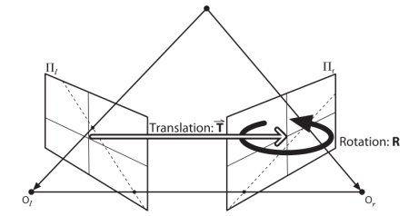

# 线性几何

## 目标

在本章中，

- 我们将了解基础的多视图几何
- 我们将看到什么是极点，极线，线性约束等等

## 基本概念

当我们使用针孔摄像机拍照的时候，我们将失去一个重要的信息，即图像的深度。或者是每一个点由于 3D 到 2D 转换导致的到摄像机远近距离问题。所以这有着一个严重的问题就是我们能否使用这些摄像机找到深度信息。这个问题的答案便是使用不止一个摄像机。我们的眼睛也以相似的方式工作，我们使用两个摄像机(两只眼睛)，这种方案分支被称作立体视觉。所以让我们看看 OpenCV 在这个领域提供了什么信息。

(《学习 OpenCV》(Gary Bradsky 著)有着关于这个领域很多的知识)

在我们投入到图像深度问题前，我们首先先要了解一些关于多视图几何的基本概念。在这一部分，我们将讨论线性几何。请看下面这张图片，它展示了一个两个摄像头拍摄相同场景的基本配置。


<center>epipolar image</center>

如果我们只使用左边的摄像机，我们将不能找到 3D 点在图像中对应的$$x$$坐标因为在$$OX$$直线上的每一个点都会投影到图像平面中的同一个点。但是我们也会考虑右侧的图像。现在，$$OX$$直线上的不同的点会投影到右平面上不同的点($$x'$$)了。所以通过这两个图像，我们便可以三角测量出正确的 3D 点。这便是整个的思路。

所有在$$OX$$上不同的点在右平面上形成了一条直线(直线$$l'$$)。我们将其称为点$$x$$对应的**极线**。这意味着在右侧图像寻找点$$x$$仅需要搜寻极线上的点。这个点可能在这条线的任意位置(试想一下，为了在图像中寻找到匹配点，你不需要在整张图像中寻找，而是仅在一条极线上寻找。这会大大提升运算效率和准确性)。这种方法被称作**线性约束**。类似地，所有点将在另一图像中具有其对应的极线。平面$$XOO'$$被称作**极平面**。

$$O$$和$$O'$$是相机投影中心。通过上面的方法，我们可以看到右侧摄像机的$$O'$$在左侧图像上的投影点，$$e$$。这个点被称作**极点**。这个极点是投影中心连线与图像平面的交点。类似的，$$e'$$是左摄像机的极点。在某些情况下，你将无法在图像中找到极点，它们可能置于图像外(这意味着，一台摄像机无法看到另一台)。

所有极线都会过极点。所以找到极点，我们便可以找到许多极线并找到他们的交叉点。

所以在这一部分，我们将着眼于寻找极线和极点。但是为了找到它们，我们还需要两个参数，**基础矩阵(F)**和**本征矩阵(E)**。本征矩阵包括平移和旋转的信息，用以描述第二个摄像机在全局坐标中相对于第一个摄像机的位置。观察下面的图像(图片来源：Gary Bradsky 所著《学习 OpenCV》)



<center>essential matrix image</center>

但我们更喜欢以像素坐标进行测量，不是吗？基础矩阵包含有同本质矩阵相同的信息，以及关于两个摄像头的本征信息，以便我们可以在像素坐标中关联两个摄像头(如果我们使用校正后的图像，并用焦距除以该点标准化，则$$F=E$$)。简而言之，基础矩阵 F，会将图像上的一个点映射为另一个图像的一条线(极线)。这是通过两个图像之间的匹配点计算出来的。最少需要 8 个这样的点用以寻找基础矩阵(同时使用 8 点算法)。越多点是越好的，这使得我们可以使用 RANSAC 获得更加可信的结果。

## 代码

首先，我们需要在两个图像之间找到尽可能多的匹配，以找到基础矩阵。为此，我们将 SIFT 描述符与基于 FLANN 的匹配器和比率测试结合使用。

```python
import numpy as np
import cv2 as cv
from matplotlib import pyplot as plt

img1 = cv.imread('myleft.jpg',0)  #查询图像 # 左图像
img2 = cv.imread('myright.jpg',0) #训练图像 # 右图像

sift = cv.SIFT()

# 使用 SIFT 获得特征点和描述符
kp1, des1 = sift.detectAndCompute(img1,None)
kp2, des2 = sift.detectAndCompute(img2,None)

# FLANN 参数
FLANN_INDEX_KDTREE = 1
index_params = dict(algorithm = FLANN_INDEX_KDTREE, trees = 5)
search_params = dict(checks=50)

flann = cv.FlannBasedMatcher(index_params,search_params)
matches = flann.knnMatch(des1,des2,k=2)

good = []
pts1 = []
pts2 = []

# 根据 Lowe's 的论文进行比率测试
for i,(m,n) in enumerate(matches):
    if m.distance < 0.8*n.distance:
        good.append(m)
        pts2.append(kp2[m.trainIdx].pt)
        pts1.append(kp1[m.queryIdx].pt)
```

现在我们有两张图片的最佳匹配列表。让我们找到基础矩阵。

```python
pts1 = np.int32(pts1)
pts2 = np.int32(pts2)
F, mask = cv.findFundamentalMat(pts1,pts2,cv.FM_LMEDS)

# 我们只会选取内部点
pts1 = pts1[mask.ravel()==1]
pts2 = pts2[mask.ravel()==1]
```

接下来我们寻找极线。极线对应的于第一图像上的点将被绘制到第二图像上。所以在这里提到正确图像很重要。我们得到了一系列线组成的数组。所以我们定义一个新的函数来在图象上绘制这些线条。

```python
def drawlines(img1,img2,lines,pts1,pts2):
    ''' img1 - 为了在 img2 为点绘制极线的图像
        lines - 对应的极线 '''
    r,c = img1.shape
    img1 = cv.cvtColor(img1,cv.COLOR_GRAY2BGR)
    img2 = cv.cvtColor(img2,cv.COLOR_GRAY2BGR)
    for r,pt1,pt2 in zip(lines,pts1,pts2):
        color = tuple(np.random.randint(0,255,3).tolist())
        x0,y0 = map(int, [0, -r[2]/r[1] ])
        x1,y1 = map(int, [c, -(r[2]+r[0]*c)/r[1] ])
        img1 = cv.line(img1, (x0,y0), (x1,y1), color,1)
        img1 = cv.circle(img1,tuple(pt1),5,color,-1)
        img2 = cv.circle(img2,tuple(pt2),5,color,-1)
    return img1,img2
```

现在我们在两个图像中找到了极线并绘制它们。

```python
# 寻找到极线在右图像(第二图像)对应的点并
# 在左图像绘制连线
lines1 = cv.computeCorrespondEpilines(pts2.reshape(-1,1,2), 2,F)
lines1 = lines1.reshape(-1,3)
img5,img6 = drawlines(img1,img2,lines1,pts1,pts2)

# 寻找到极线在左图像(第一图像)对应的点并
# 在右图像绘制连线
lines2 = cv.computeCorrespondEpilines(pts1.reshape(-1,1,2), 1,F)
lines2 = lines2.reshape(-1,3)
img3,img4 = drawlines(img2,img1,lines2,pts2,pts1)

plt.subplot(121),plt.imshow(img5)
plt.subplot(122),plt.imshow(img3)
plt.show()
```

下面就是我们得到的结果：


<center>epiresult image</center>

你可以看到左边的图像所有的极线都汇聚到右侧图像外的一点。那个汇聚点便是极点。

为了获得更好的效果，应使用具有良好分辨率且包含许多非平面点的图像。

## 其他资源

## 练习

1. 一个重要的话题是相机的向前移动。然后，在固定点出现的 epilines 中，将在相同的位置看到 epipoles。[查看这个讨论](http://answers.opencv.org/question/17912/location-of-epipole/)。
2. 基础矩阵估计对于匹配质量，异常值等等很敏感。当所有选定的匹配点位于同一平面上时，情况会变得更糟。[查看这个讨论](http://answers.opencv.org/question/18125/epilines-not-correct/)。
