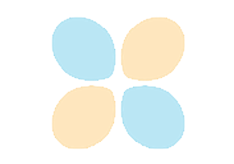

# 针对NLP的Pytorch深度学习

> 译者：[@JingTao](https://github.com/jingwangfei)、[@friedhelm739](https://github.com/friedhelm739)

**作者**: [Robert Guthrie](https://github.com/rguthrie3/DeepLearningForNLPInPytorch)

本教程将带你浏览基于Pytorch深度学习编程的核心思想.其中很多思想(例如计算图形抽象化以及自动求导) 并不是Pytorch特有的,他们和任何深度学习工具包都是相关的.

本教程针对那些从未在任何深度学习框架下编写过代码的人(例如TensorFlow,Theano, Keras, Dynet),并 专注于NLP.它提出了应用知识中NLP的核心问题:词性标注,语言建模等.它同样提出了在AI入门级别熟悉神经 网络(例如Russel和Norvig的书).通常情况下, 这些课程包括了基于前馈神经网络的基本的反向传播算法, 并使你了解到它们是线性和非线性组成的链条.本教程目的使你开始编写深度学习代码并给你首要必备的知识.

提示一下, 这仅关乎于 _模型_ , 并非是数据.针对所有模型,我仅仅提出了一些低纬度的例子 以便于你可以观察当训练时权重的变化.如果你有一些真实数据去尝试,可以将本教程中模型 复制下并将数据应用到模型上.

[PyTorch介绍](nlp/pytorch_tutorial.html#sphx-glr-beginner-nlp-pytorch-tutorial-py)

[PyTorch深度学习](nlp/deep_learning_tutorial.html#sphx-glr-beginner-nlp-deep-learning-tutorial-py)

[词汇嵌入:编码词汇语义](nlp/word_embeddings_tutorial.html#sphx-glr-beginner-nlp-word-embeddings-tutorial-py)

[序列模型和 LSTM 网络(长短记忆网络）](nlp/sequence_models_tutorial.html#sphx-glr-beginner-nlp-sequence-models-tutorial-py)

[高级教程: 作出动态决策和 Bi-LSTM CRF](nlp/advanced_tutorial.html#sphx-glr-beginner-nlp-advanced-tutorial-py)