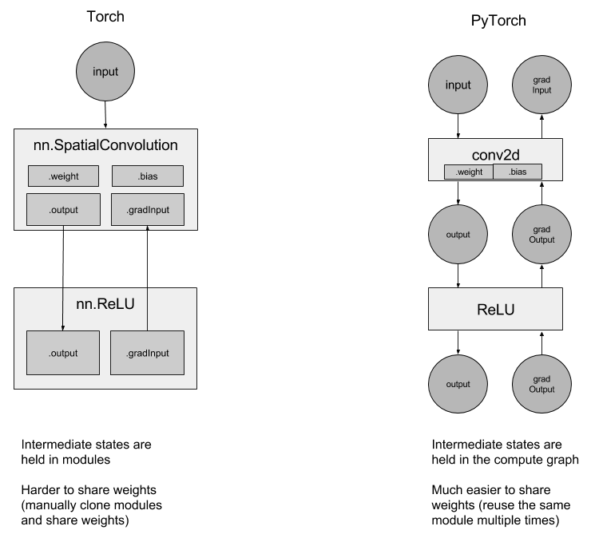

# nn package

> 译者：@unknown
> 
> 校对者：[@bringtree](https://github.com/bringtree)

我们重新设计了 nn package, 以便与 autograd 完全集成. 让我们来回顾一下这些变化.

**用 autograd 替换 containers:**

> 你不再需要使用像 `ConcatTable` 这样的 Containers, 或者像 `CAddTable` 这样的模块, 或者使用 nngraph 并且 debug. 我们将无缝地使用 autograd 来定义我们的神经网络. 例如,
> 
> *   `output = nn.CAddTable():forward({input1, input2})` 简化为 `output = input1 + input2`
> *   `output = nn.MulConstant(0.5):forward(input)` 简化为 `output = input * 0.5`

**中间状态不再存放在上述提到的那些模块中, 而是存放在计算图中:**

> 因为这个原因, 所以使用循环网络变得更加简单. 如果你想创建一个循环网络, 只需多次使用相同的 Linear 层, 而不必考虑共享权重.
> 
> 
> 
> torch-nn-vs-pytorch-nn

**Simplified debugging:**

> 使用Python的pdb调试器进行调试是直观的, 调试器和堆栈跟踪在发生错误的地方停止. What you see is what you get(所见即所得, 译者注:应该是说可视化吧).

## Example 1: ConvNet

让我们来创建一个小的 ConvNet.

你所有的网络都来自 `nn.Module` 基类:

*   在构造函数中, 声明你想要使用的所有层.
*   在 forward 函数中, 你可以定义模型从输入到输出将如何运行

```py
import torch
from torch.autograd import Variable
import torch.nn as nn
import torch.nn.functional as F

class MNISTConvNet(nn.Module):

    def __init__(self):
        # 这是你实例化所有模块的地方
        # 你可以稍后使用你在此给出的相同名称访问它们
        super(MNISTConvNet, self).__init__()
        self.conv1 = nn.Conv2d(1, 10, 5)
        self.pool1 = nn.MaxPool2d(2, 2)
        self.conv2 = nn.Conv2d(10, 20, 5)
        self.pool2 = nn.MaxPool2d(2, 2)
        self.fc1 = nn.Linear(320, 50)
        self.fc2 = nn.Linear(50, 10)

    # 这是 forward 函数, 它定义了只接受一个输入的网络结构,
    # 如果你愿意, 可以随意定义支持使用更多输入的网络结构.
    def forward(self, input):
        x = self.pool1(F.relu(self.conv1(input)))
        x = self.pool2(F.relu(self.conv2(x)))

        # 在你的创建模型的过程中, 你可以疯狂地使用任意的python代码创建你的模型结构,
        # 这些操作都是完全合法的, 并且会被autograd正确处理:
        # if x.gt(0) > x.numel() / 2:
        #      ...
        #
        # 你甚至可以做一个循环来重复使用相同的模块, 模块内部的模块不再
        # 处于临时状态, 所以你可以在 forward 时多次使用它们.
        # while x.norm(2) < 10:
        #    x = self.conv1(x)

        x = x.view(x.size(0), -1)
        x = F.relu(self.fc1(x))
        x = F.relu(self.fc2(x))
        return x

```

现在让我们来使用定义好的 ConvNet. 你应该先创建一个类的实例.

```py
net = MNISTConvNet()
print(net)

```

注解：

`torch.nn` 只支持 mini-batches , 整个 `torch.nn` package 只支持输入 mini-batch 格式的样本, 而不支持输入单个样本.

例如, `nn.Conv2d` 将采用 `nSamples x nChannels x Height x Width` 的 4D Tensor.

如果你有一个单个的样本, 只需使用 `input.unsqueeze(0)` 添加一个 虚假的 batch 维度.

创建一个包含随机数据的单个样本的 mini-batch, 并将该样本传入到 ConvNet .

```py
input = Variable(torch.randn(1, 1, 28, 28))
out = net(input)
print(out.size())

```

定义一个虚拟目标标签, 并使用损失函数来计算 error.

```py
target = Variable(torch.LongTensor([3]))
loss_fn = nn.CrossEntropyLoss()  # LogSoftmax + ClassNLL Loss
err = loss_fn(out, target)
err.backward()

print(err)

```

ConvNet 的 `out` 是一个 `Variable`. 我们使用它来计算损失, 计算结果 `err` 也是一个 `Variable`. 调用 `err` 的 `.backward` 方法将会通过 ConvNet 将梯度传播到它的权重.

让我们来访问单个层的权重和梯度:

```py
print(net.conv1.weight.grad.size())

```

```py
print(net.conv1.weight.data.norm())  # norm of the weight
print(net.conv1.weight.grad.data.norm())  # norm of the gradients

```

## Forward and Backward Function Hooks

我们已经检查了权重和梯度. 但是如何检查 / 修改一个层的输出和 grad_output?

我们为此引出了 **hooks**.

你可以在一个 `Module` 或一个 `Variable` 上注册一个函数. hook 可以是 forward hook 也可以是一个 backward hook. 当 forward 被执行后 forward hook 将会被执行. backward hook 将在执行 backward 阶段被执行. 让我们来看一个例子.

我们在 conv2 注册一个 forward hook 来打印一些信息

```py
def printnorm(self, input, output):
    # input是将输入打包成的 tuple 的input
    # 输出是一个 Variable. output.data 是我们感兴趣的 Tensor
    print('Inside ' + self.__class__.__name__ + ' forward')
    print('')
    print('input: ', type(input))
    print('input[0]: ', type(input[0]))
    print('output: ', type(output))
    print('')
    print('input size:', input[0].size())
    print('output size:', output.data.size())
    print('output norm:', output.data.norm())

net.conv2.register_forward_hook(printnorm)

out = net(input)

```

我们在 conv2 注册一个 backward hook 来打印一些信息

```py
def printgradnorm(self, grad_input, grad_output):
    print('Inside ' + self.__class__.__name__ + ' backward')
    print('Inside class:' + self.__class__.__name__)
    print('')
    print('grad_input: ', type(grad_input))
    print('grad_input[0]: ', type(grad_input[0]))
    print('grad_output: ', type(grad_output))
    print('grad_output[0]: ', type(grad_output[0]))
    print('')
    print('grad_input size:', grad_input[0].size())
    print('grad_output size:', grad_output[0].size())
    print('grad_input norm:', grad_input[0].data.norm())

net.conv2.register_backward_hook(printgradnorm)

out = net(input)
err = loss_fn(out, target)
err.backward()

```

一个完整的可以运行的 MNIST 例子在此链接中 [https://github.com/pytorch/examples/tree/master/mnist](https://github.com/pytorch/examples/tree/master/mnist)

## Example 2: Recurrent Net

接下来, 让我们看一下用 PyTorch 创建 recurrent nets.

由于网络的状态是保存在图中, 而不是在 layer 中, 所以您可以简单地 创建一个 nn.Linear 并重复使用它.

```py
class RNN(nn.Module):

    # 你也可以在你模型的构造函数中传入参数
    def __init__(self, data_size, hidden_size, output_size):
        super(RNN, self).__init__()

        self.hidden_size = hidden_size
        input_size = data_size + hidden_size

        self.i2h = nn.Linear(input_size, hidden_size)
        self.h2o = nn.Linear(hidden_size, output_size)

    def forward(self, data, last_hidden):
        input = torch.cat((data, last_hidden), 1)
        hidden = self.i2h(input)
        output = self.h2o(hidden)
        return hidden, output

rnn = RNN(50, 20, 10)

```

更完整的使用 LSTMs 和 Penn Tree-bank 的语言模型位于 [here](https://github.com/pytorch/examples/tree/master/word_language_model)

PyTorch 默认已经为 ConvNets 和 Recurrent Nets 提供了无缝的 CuDNN 集成.

```py
loss_fn = nn.MSELoss()

batch_size = 10
TIMESTEPS = 5

# 创建一些假数据
batch = Variable(torch.randn(batch_size, 50))
hidden = Variable(torch.zeros(batch_size, 20))
target = Variable(torch.zeros(batch_size, 10))

loss = 0
for t in range(TIMESTEPS):
    # 是的! 你可以多次使用同一个网络,
    # 将损失相加, 并且调用 call backward!
    hidden, output = rnn(batch, hidden)
    loss += loss_fn(output, target)
loss.backward()

```
