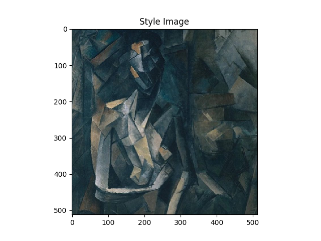
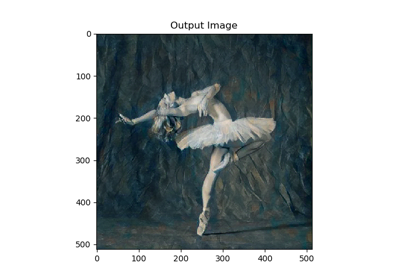

# 使用PyTorch进行图像风格转换

> 译者：[bdqfork](https://github.com/bdqfork)

**作者**: [Alexis Jacq](https://alexis-jacq.github.io)

## 简介

本教程主要讲解如何实现由Leon A. Gatys，Alexander S. Ecker和Matthias Bethge提出的 [Neural-Style 算法](https://arxiv.org/abs/1508.06576)。Neural-Style或者叫Neural-Transfer，可以让你使用一种新的风格将指定的图片进行重构。这个算法使用三张图片，一张输入图片，一张内容图片和一张风格图片，并将输入的图片变得与内容图片相似，且拥有风格图片的优美风格。


## 基本原理

原理很简单：我们定义两个间距，一个用于内容`D_C`，另一个用于风格`D_S`。`D_C`测量两张图片内容的不同，而`D_S`用来测量两张图片风格的不同。然后，我们输入第三张图片，并改变这张图片，使其与内容图片的内容间距和风格图片的风格间距最小化。现在，我们可以导入必要的包，开始图像风格转换。

## 导包并选择设备

下面是一张实现图像风格转换所需包的清单。

*   `torch`, `torch.nn`, `numpy` (使用PyTorch进行风格转换必不可少的包)
*   `torch.optim` (高效的梯度下降)
*   `PIL`, `PIL.Image`, `matplotlib.pyplot` (加载和展示图片)
*   `torchvision.transforms` (将PIL图片转换成张量)
*   `torchvision.models` (训练或加载预训练模型)
*   `copy` (对模型进行深度拷贝；系统包)

```py
from __future__ import print_function

import torch
import torch.nn as nn
import torch.nn.functional as F
import torch.optim as optim

from PIL import Image
import matplotlib.pyplot as plt

import torchvision.transforms as transforms
import torchvision.models as models

import copy

```

下一步，我们选择用哪一个设备来运行神经网络，导入内容和风格图片。在大量图片上运行图像风格算法需要很长时间，在GPU上运行可以加速。我们可以使用`torch.cuda.is_available()`来判断是否有可用的GPU。下一步，我们在整个教程中使用 `torch.device` 。 `.to(device)` 方法也被用来将张量或者模型移动到指定设备。

```py
device = torch.device("cuda" if torch.cuda.is_available() else "cpu")
```

## 加载图片

现在我们将导入风格和内容图片。原始的PIL图片的值介于0到255之间，但是当转换成torch张量时，它们的值被转换成0到1之间。图片也需要被重设成相同的维度。一个重要的细节是，注意torch库中的神经网络用来训练的张量的值为0到1之间。如果你尝试将0到255的张量图片加载到神经网络，然后激活的特征映射将不能侦测到目标内容和风格。然而，Caffe库中的预训练网络用来训练的张量值为0到255之间的图片。

**注意**

这是一个下载本教程需要用到的图片的链接： [picasso.jpg](https://pytorch.org/tutorials/_static/img/neural-style/picasso.jpg) 和 [dancing.jpg](https://pytorch.org/tutorials/_static/img/neural-style/dancing.jpg)。下载这两张图片并且将它们添加到你当前工作目录中的 `images` 文件夹。

```py
# desired size of the output image
imsize = 512 if torch.cuda.is_available() else 128  # use small size if no gpu

loader = transforms.Compose([
    transforms.Resize(imsize),  # scale imported image
    transforms.ToTensor()])  # transform it into a torch tensor

def image_loader(image_name):
    image = Image.open(image_name)
    # fake batch dimension required to fit network's input dimensions
    image = loader(image).unsqueeze(0)
    return image.to(device, torch.float)

style_img = image_loader("./data/images/neural-style/picasso.jpg")
content_img = image_loader("./data/images/neural-style/dancing.jpg")

assert style_img.size() == content_img.size(), \
    "we need to import style and content images of the same size"

```

现在，让我们创建一个方法，通过重新将图片转换成PIL格式来展示，并使用`plt.imshow`展示它的拷贝。我们将尝试展示内容和风格图片来确保它们被正确的导入。

```py
unloader = transforms.ToPILImage()  # reconvert into PIL image

plt.ion()

def imshow(tensor, title=None):
    image = tensor.cpu().clone()  # we clone the tensor to not do changes on it
    image = image.squeeze(0)      # remove the fake batch dimension
    image = unloader(image)
    plt.imshow(image)
    if title is not None:
        plt.title(title)
    plt.pause(0.001) # pause a bit so that plots are updated

plt.figure()
imshow(style_img, title='Style Image')

plt.figure()
imshow(content_img, title='Content Image')

```

*   
*   

## 损失函数

### 内容损失

内容损失是一个表示一层内容间距的加权版本。这个方法使用网络中的L层的特征映射`F_XL`，该网络处理输入X并返回在图片X和内容图片C之间的加权内容间距`W_CL*D_C^L(X,C)`。该方法必须知道内容图片(`F_CL`）的特征映射来计算内容间距。我们使用一个以`F_CL`作为构造参数输入的torch模型来实现这个方法。间距`||F_XL-F_CL||^2`是两个特征映射集合之间的平均方差，可以使用`nn.MSELoss`来计算。

我们将直接添加这个内容损失模型到被用来计算内容间距的卷积层之后。这样每一次输入图片到网络中时，内容损失都会在目标层被计算。而且因为自动求导的缘故，所有的梯度都会被计算。现在，为了使内容损失层透明化，我们必须定义一个`forward`方法来计算内容损失，同时返回该层的输入。计算的损失作为模型的参数被保存。

```py
class ContentLoss(nn.Module):

    def __init__(self, target,):
        super(ContentLoss, self).__init__()
        # we 'detach' the target content from the tree used
        # to dynamically compute the gradient: this is a stated value,
        # not a variable. Otherwise the forward method of the criterion
        # will throw an error.
        self.target = target.detach()

    def forward(self, input):
        self.loss = F.mse_loss(input, self.target)
        return input

```

**注意**

**重要细节**：尽管这个模型的名称被命名为 `ContentLoss`, 它不是一个真实的PyTorch损失方法。如果你想要定义你的内容损失为PyTorch Loss方法，你必须创建一个PyTorch自动求导方法来手动的在`backward`方法中重计算/实现梯度.

### 风格损失

风格损失模型与内容损失模型的实现方法类似。它要作为一个网络中的透明层，来计算相应层的风格损失。为了计算风格损失，我们需要计算Gram矩阵`G_XL`。Gram矩阵是将给定矩阵和它的转置矩阵的乘积。在这个应用中，给定的矩阵是L层特征映射`F_XL`的重塑版本。`F_XL`被重塑成` F̂_XL`，一个*KxN*的矩阵，其中K是L层特征映射的数量，N是任何向量化特征映射`F_XL^K`的长度。例如，第一行的`F̂_XL`与第一个向量化的`F_XL^1`。

最后，Gram矩阵必须通过将每一个元素除以矩阵中所有元素的数量进行标准化。标准化是为了消除拥有很大的N维度`F̂_XL`在Gram矩阵中产生的很大的值。这些很大的值将在梯度下降的时候，对第一层(在池化层之前）产生很大的影响。风格特征往往在网络中更深的层，所以标准化步骤是很重要的。

```py
def gram_matrix(input):
    a, b, c, d = input.size()  # a=batch size(=1)
    # b=number of feature maps
    # (c,d)=dimensions of a f. map (N=c*d)

    features = input.view(a * b, c * d)  # resise F_XL into \hat F_XL

    G = torch.mm(features, features.t())  # compute the gram product

    # we 'normalize' the values of the gram matrix
    # by dividing by the number of element in each feature maps.
    return G.div(a * b * c * d)

```

现在风格损失模型看起来和内容损失模型很像。风格间距也用`G_XL`和`G_SL`之间的均方差来计算。

```py
class StyleLoss(nn.Module):

    def __init__(self, target_feature):
        super(StyleLoss, self).__init__()
        self.target = gram_matrix(target_feature).detach()

    def forward(self, input):
        G = gram_matrix(input)
        self.loss = F.mse_loss(G, self.target)
        return input

```

## 导入模型

现在我们需要导入预训练的神经网络。我们将使用19层的VGG网络，就像论文中使用的一样。

PyTorch的VGG模型实现被分为了两个字`Sequential`模型：`features`(包含卷积层和池化层）和`classifier`(包含全连接层）。我们将使用`features`模型，因为我们需要每一层卷积层的输出来计算内容和风格损失。在训练的时候有些层会有和评估不一样的行为，所以我们必须用`.eval()`将网络设置成评估模式。

```py
cnn = models.vgg19(pretrained=True).features.to(device).eval()

```

此外，VGG网络通过使用mean=[0.485, 0.456, 0.406]和std=[0.229, 0.224, 0.225]参数来标准化图片的每一个通道，并在图片上进行训练。因此，我们将在把图片输入神经网络之前，先使用这些参数对图片进行标准化。

```py
cnn_normalization_mean = torch.tensor([0.485, 0.456, 0.406]).to(device)
cnn_normalization_std = torch.tensor([0.229, 0.224, 0.225]).to(device)

# create a module to normalize input image so we can easily put it in a
# nn.Sequential
class Normalization(nn.Module):
    def __init__(self, mean, std):
        super(Normalization, self).__init__()
        # .view the mean and std to make them [C x 1 x 1] so that they can
        # directly work with image Tensor of shape [B x C x H x W].
        # B is batch size. C is number of channels. H is height and W is width.
        self.mean = torch.tensor(mean).view(-1, 1, 1)
        self.std = torch.tensor(std).view(-1, 1, 1)

    def forward(self, img):
        # normalize img
        return (img - self.mean) / self.std

```

一个`Sequential`模型包含一个顺序排列的子模型序列。例如，`vff19.features`包含一个以正确的深度顺序排列的序列(Conv2d, ReLU, MaxPool2d, Conv2d, ReLU…）。我们需要将我们自己的内容损失和风格损失层在感知到卷积层之后立即添加进去。因此，我们必须创建一个新的`Sequential`模型，并正确的插入内容损失和风格损失模型。

```py
# desired depth layers to compute style/content losses :
content_layers_default = ['conv_4']
style_layers_default = ['conv_1', 'conv_2', 'conv_3', 'conv_4', 'conv_5']

def get_style_model_and_losses(cnn, normalization_mean, normalization_std,
                               style_img, content_img,
                               content_layers=content_layers_default,
                               style_layers=style_layers_default):
    cnn = copy.deepcopy(cnn)

    # normalization module
    normalization = Normalization(normalization_mean, normalization_std).to(device)

    # just in order to have an iterable access to or list of content/syle
    # losses
    content_losses = []
    style_losses = []

    # assuming that cnn is a nn.Sequential, so we make a new nn.Sequential
    # to put in modules that are supposed to be activated sequentially
    model = nn.Sequential(normalization)

    i = 0  # increment every time we see a conv
    for layer in cnn.children():
        if isinstance(layer, nn.Conv2d):
            i += 1
            name = 'conv_{}'.format(i)
        elif isinstance(layer, nn.ReLU):
            name = 'relu_{}'.format(i)
            # The in-place version doesn't play very nicely with the ContentLoss
            # and StyleLoss we insert below. So we replace with out-of-place
            # ones here.
            layer = nn.ReLU(inplace=False)
        elif isinstance(layer, nn.MaxPool2d):
            name = 'pool_{}'.format(i)
        elif isinstance(layer, nn.BatchNorm2d):
            name = 'bn_{}'.format(i)
        else:
            raise RuntimeError('Unrecognized layer: {}'.format(layer.__class__.__name__))

        model.add_module(name, layer)

        if name in content_layers:
            # add content loss:
            target = model(content_img).detach()
            content_loss = ContentLoss(target)
            model.add_module("content_loss_{}".format(i), content_loss)
            content_losses.append(content_loss)

        if name in style_layers:
            # add style loss:
            target_feature = model(style_img).detach()
            style_loss = StyleLoss(target_feature)
            model.add_module("style_loss_{}".format(i), style_loss)
            style_losses.append(style_loss)

    # now we trim off the layers after the last content and style losses
    for i in range(len(model) - 1, -1, -1):
        if isinstance(model[i], ContentLoss) or isinstance(model[i], StyleLoss):
            break

    model = model[:(i + 1)]

    return model, style_losses, content_losses

```

下一步，我们选择输入图片。你可以使用内容图片的副本或者白噪声。

```py
input_img = content_img.clone()
# if you want to use white noise instead uncomment the below line:
# input_img = torch.randn(content_img.data.size(), device=device)

# add the original input image to the figure:
plt.figure()
imshow(input_img, title='Input Image')

```


## 梯度下降

和算法的作者Leon Gatys的在 [这里](https://discuss.pytorch.org/t/pytorch-tutorial-for-neural-transfert-of-artistic-style/336/20?u=alexis-jacq)建议的一样，我们将使用L-BFGS算法来进行我们的梯度下降。与训练一般网络不同，我们训练输入图片是为了最小化内容/风格损失。我们要创建一个PyTorch的L-BFGS优化器`optim.LBFGS`，并传入我们的图片到其中，作为张量去优化。

```py
def get_input_optimizer(input_img):
    # this line to show that input is a parameter that requires a gradient
    optimizer = optim.LBFGS([input_img.requires_grad_()])
    return optimizer

```

最后，我们必须定义一个方法来展示图像风格转换。对于每一次的网络迭代，都将更新过的输入传入其中并计算损失。我们要运行每一个损失模型的`backward`方法来计算它们的梯度。优化器需要一个“关闭”方法，它重新估计模型并且返回损失。

我们还有最后一个问题要解决。神经网络可能会尝试使张量图片的值超过0到1之间来优化输入。我们可以通过在每次网络运行的时候将输入的值矫正到0到1之间来解决这个问题。

```py
def run_style_transfer(cnn, normalization_mean, normalization_std,
                       content_img, style_img, input_img, num_steps=300,
                       style_weight=1000000, content_weight=1):
    """Run the style transfer."""
    print('Building the style transfer model..')
    model, style_losses, content_losses = get_style_model_and_losses(cnn,
        normalization_mean, normalization_std, style_img, content_img)
    optimizer = get_input_optimizer(input_img)

    print('Optimizing..')
    run = [0]
    while run[0] <= num_steps:

        def closure():
            # correct the values of updated input image
            input_img.data.clamp_(0, 1)

            optimizer.zero_grad()
            model(input_img)
            style_score = 0
            content_score = 0

            for sl in style_losses:
                style_score += sl.loss
            for cl in content_losses:
                content_score += cl.loss

            style_score *= style_weight
            content_score *= content_weight

            loss = style_score + content_score
            loss.backward()

            run[0] += 1
            if run[0] % 50 == 0:
                print("run {}:".format(run))
                print('Style Loss : {:4f} Content Loss: {:4f}'.format(
                    style_score.item(), content_score.item()))
                print()

            return style_score + content_score

        optimizer.step(closure)

    # a last correction...
    input_img.data.clamp_(0, 1)

    return input_img

```

最后，我们可以运行这个算法。

```py
output = run_style_transfer(cnn, cnn_normalization_mean, cnn_normalization_std,
                            content_img, style_img, input_img)

plt.figure()
imshow(output, title='Output Image')

# sphinx_gallery_thumbnail_number = 4
plt.ioff()
plt.show()

```



输出:

```py
Building the style transfer model..
Optimizing..
run [50]:
Style Loss : 4.169304 Content Loss: 4.235329

run [100]:
Style Loss : 1.145476 Content Loss: 3.039176

run [150]:
Style Loss : 0.716769 Content Loss: 2.663749

run [200]:
Style Loss : 0.476047 Content Loss: 2.500893

run [250]:
Style Loss : 0.347092 Content Loss: 2.410895

run [300]:
Style Loss : 0.263698 Content Loss: 2.358449

```

