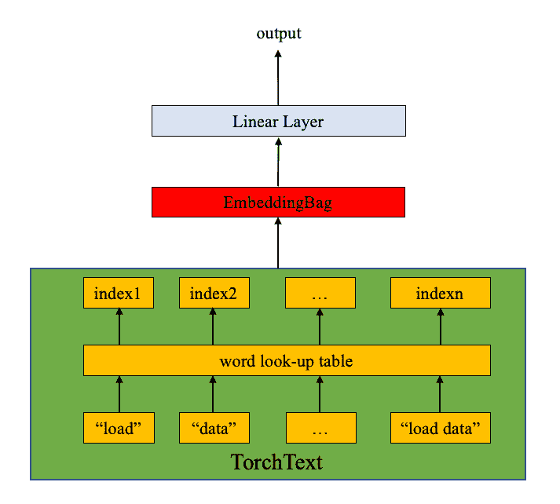

# 使用 TorchText 进行文本分类

> 原文： [https://pytorch.org/tutorials/beginner/text_sentiment_ngrams_tutorial.html](https://pytorch.org/tutorials/beginner/text_sentiment_ngrams_tutorial.html)

注意

单击此处的[下载完整的示例代码](#sphx-glr-download-beginner-text-sentiment-ngrams-tutorial-py)

本教程介绍了如何使用`torchtext`中的文本分类数据集，包括

```
- AG_NEWS,
- SogouNews,
- DBpedia,
- YelpReviewPolarity,
- YelpReviewFull,
- YahooAnswers,
- AmazonReviewPolarity,
- AmazonReviewFull

```

本示例说明了如何使用这些`TextClassification`数据集之一训练用于分类的监督学习算法。

## 用 ngram 加载数据

一袋 ngrams 功能用于捕获有关本地单词顺序的一些部分信息。 在实践中，应用二元语法或三元语法作为单词组比仅仅一个单词提供更多的好处。 一个例子：

```
"load data with ngrams"
Bi-grams results: "load data", "data with", "with ngrams"
Tri-grams results: "load data with", "data with ngrams"

```

`TextClassification`数据集支持 ngrams 方法。 通过将 ngrams 设置为 2，数据集中的示例文本将是一个单字加 bi-grams 字符串的列表。

```
import torch
import torchtext
from torchtext.datasets import text_classification
NGRAMS = 2
import os
if not os.path.isdir('./.data'):
    os.mkdir('./.data')
train_dataset, test_dataset = text_classification.DATASETS['AG_NEWS'](
    root='./.data', ngrams=NGRAMS, vocab=None)
BATCH_SIZE = 16
device = torch.device("cuda" if torch.cuda.is_available() else "cpu")

```

## 定义模型

该模型由 [EmbeddingBag](https://pytorch.org/docs/stable/nn.html?highlight=embeddingbag#torch.nn.EmbeddingBag) 层和线性层组成(请参见下图）。 `nn.EmbeddingBag`计算嵌入“袋”的平均值。 此处的文本条目具有不同的长度。 `nn.EmbeddingBag`此处不需要填充，因为文本长度以偏移量保存。

另外，由于`nn.EmbeddingBag`会动态累积嵌入中的平均值，因此`nn.EmbeddingBag`可以提高性能和存储效率，以处理张量序列。



```
import torch.nn as nn
import torch.nn.functional as F
class TextSentiment(nn.Module):
    def __init__(self, vocab_size, embed_dim, num_class):
        super().__init__()
        self.embedding = nn.EmbeddingBag(vocab_size, embed_dim, sparse=True)
        self.fc = nn.Linear(embed_dim, num_class)
        self.init_weights()

    def init_weights(self):
        initrange = 0.5
        self.embedding.weight.data.uniform_(-initrange, initrange)
        self.fc.weight.data.uniform_(-initrange, initrange)
        self.fc.bias.data.zero_()

    def forward(self, text, offsets):
        embedded = self.embedding(text, offsets)
        return self.fc(embedded)

```

## 启动实例

AG_NEWS 数据集具有四个标签，因此类别数是四个。

```
1 : World
2 : Sports
3 : Business
4 : Sci/Tec

```

词汇的大小等于词汇的长度(包括单个单词和 ngram）。 类的数量等于标签的数量，在 AG_NEWS 情况下为 4。

```
VOCAB_SIZE = len(train_dataset.get_vocab())
EMBED_DIM = 32
NUN_CLASS = len(train_dataset.get_labels())
model = TextSentiment(VOCAB_SIZE, EMBED_DIM, NUN_CLASS).to(device)

```

## 用于生成批处理的函数

由于文本条目的长度不同，因此使用自定义函数 generate_batch(）生成数据批和偏移量。 该功能将传递到`torch.utils.data.DataLoader`中的`collate_fn`。 `collate_fn`的输入是张量为 list_batch_size 的张量列表，`collate_fn`函数将它们打包成一个小批量。 请注意此处，并确保将`collate_fn`声明为顶级 def。 这样可以确保该功能在每个工作程序中均可用。

原始数据批处理输入中的文本条目打包到一个列表中，并作为单个张量级联，作为`nn.EmbeddingBag`的输入。 偏移量是定界符的张量，表示文本张量中各个序列的起始索引。 Label 是一个张量，用于保存单个文本条目的标签。

```
def generate_batch(batch):
    label = torch.tensor([entry[0] for entry in batch])
    text = [entry[1] for entry in batch]
    offsets = [0] + [len(entry) for entry in text]
    # torch.Tensor.cumsum returns the cumulative sum
    # of elements in the dimension dim.
    # torch.Tensor([1.0, 2.0, 3.0]).cumsum(dim=0)

    offsets = torch.tensor(offsets[:-1]).cumsum(dim=0)
    text = torch.cat(text)
    return text, offsets, label

```

## 定义功能以训练模型并评估结果。

建议 PyTorch 用户使用 [torch.utils.data.DataLoader](https://pytorch.org/docs/stable/data.html?highlight=dataloader#torch.utils.data.DataLoader) ，它可以轻松地并行加载数据(教程为[，此处为](https://pytorch.org/tutorials/beginner/data_loading_tutorial.html)）。 我们在此处使用`DataLoader`加载 AG_NEWS 数据集并将其发送到模型以进行训练/验证。

```
from torch.utils.data import DataLoader

def train_func(sub_train_):

    # Train the model
    train_loss = 0
    train_acc = 0
    data = DataLoader(sub_train_, batch_size=BATCH_SIZE, shuffle=True,
                      collate_fn=generate_batch)
    for i, (text, offsets, cls) in enumerate(data):
        optimizer.zero_grad()
        text, offsets, cls = text.to(device), offsets.to(device), cls.to(device)
        output = model(text, offsets)
        loss = criterion(output, cls)
        train_loss += loss.item()
        loss.backward()
        optimizer.step()
        train_acc += (output.argmax(1) == cls).sum().item()

    # Adjust the learning rate
    scheduler.step()

    return train_loss / len(sub_train_), train_acc / len(sub_train_)

def test(data_):
    loss = 0
    acc = 0
    data = DataLoader(data_, batch_size=BATCH_SIZE, collate_fn=generate_batch)
    for text, offsets, cls in data:
        text, offsets, cls = text.to(device), offsets.to(device), cls.to(device)
        with torch.no_grad():
            output = model(text, offsets)
            loss = criterion(output, cls)
            loss += loss.item()
            acc += (output.argmax(1) == cls).sum().item()

    return loss / len(data_), acc / len(data_)

```

## 分割数据集并运行模型

由于原始 AG_NEWS 没有有效的数据集，因此我们将训练数据集分为训练/有效集，其分割比率为 0.95(训练）和 0.05(有效）。 在这里，我们在 PyTorch 核心库中使用 [torch.utils.data.dataset.random_split](https://pytorch.org/docs/stable/data.html?highlight=random_split#torch.utils.data.random_split) 函数。

[CrossEntropyLoss](https://pytorch.org/docs/stable/nn.html?highlight=crossentropyloss#torch.nn.CrossEntropyLoss) 标准将 nn.LogSoftmax(）和 nn.NLLLoss(）合并到一个类中。 在训练带有 C 类的分类问题时很有用。 [SGD](https://pytorch.org/docs/stable/_modules/torch/optim/sgd.html) 实现了随机梯度下降方法作为优化程序。 初始学习率设置为 4.0。 [StepLR](https://pytorch.org/docs/master/_modules/torch/optim/lr_scheduler.html#StepLR) 在此处用于通过历时调整学习率。

```
import time
from torch.utils.data.dataset import random_split
N_EPOCHS = 5
min_valid_loss = float('inf')

criterion = torch.nn.CrossEntropyLoss().to(device)
optimizer = torch.optim.SGD(model.parameters(), lr=4.0)
scheduler = torch.optim.lr_scheduler.StepLR(optimizer, 1, gamma=0.9)

train_len = int(len(train_dataset) * 0.95)
sub_train_, sub_valid_ = \
    random_split(train_dataset, [train_len, len(train_dataset) - train_len])

for epoch in range(N_EPOCHS):

    start_time = time.time()
    train_loss, train_acc = train_func(sub_train_)
    valid_loss, valid_acc = test(sub_valid_)

    secs = int(time.time() - start_time)
    mins = secs / 60
    secs = secs % 60

    print('Epoch: %d' %(epoch + 1), " | time in %d minutes, %d seconds" %(mins, secs))
    print(f'\tLoss: {train_loss:.4f}(train)\t|\tAcc: {train_acc * 100:.1f}%(train)')
    print(f'\tLoss: {valid_loss:.4f}(valid)\t|\tAcc: {valid_acc * 100:.1f}%(valid)')

```

出：

```
Epoch: 1  | time in 0 minutes, 9 seconds
        Loss: 0.0263(train)     |       Acc: 84.6%(train)
        Loss: 0.0000(valid)     |       Acc: 90.1%(valid)
Epoch: 2  | time in 0 minutes, 9 seconds
        Loss: 0.0120(train)     |       Acc: 93.6%(train)
        Loss: 0.0001(valid)     |       Acc: 91.4%(valid)
Epoch: 3  | time in 0 minutes, 9 seconds
        Loss: 0.0070(train)     |       Acc: 96.4%(train)
        Loss: 0.0001(valid)     |       Acc: 91.7%(valid)
Epoch: 4  | time in 0 minutes, 9 seconds
        Loss: 0.0039(train)     |       Acc: 98.0%(train)
        Loss: 0.0001(valid)     |       Acc: 91.4%(valid)
Epoch: 5  | time in 0 minutes, 9 seconds
        Loss: 0.0023(train)     |       Acc: 99.0%(train)
        Loss: 0.0001(valid)     |       Acc: 91.7%(valid)

```

使用以下信息在 GPU 上运行模型：

纪元：1 | 时间在 0 分钟 11 秒

```
Loss: 0.0263(train)     |       Acc: 84.5%(train)
Loss: 0.0001(valid)     |       Acc: 89.0%(valid)

```

纪元：2 | 时间在 0 分钟 10 秒内

```
Loss: 0.0119(train)     |       Acc: 93.6%(train)
Loss: 0.0000(valid)     |       Acc: 89.6%(valid)

```

纪元：3 | 时间在 0 分钟 9 秒

```
Loss: 0.0069(train)     |       Acc: 96.4%(train)
Loss: 0.0000(valid)     |       Acc: 90.5%(valid)

```

纪元：4 | 时间在 0 分钟 11 秒

```
Loss: 0.0038(train)     |       Acc: 98.2%(train)
Loss: 0.0000(valid)     |       Acc: 90.4%(valid)

```

纪元：5 | 时间在 0 分钟 11 秒

```
Loss: 0.0022(train)     |       Acc: 99.0%(train)
Loss: 0.0000(valid)     |       Acc: 91.0%(valid)

```

## 使用测试数据集评估模型

```
print('Checking the results of test dataset...')
test_loss, test_acc = test(test_dataset)
print(f'\tLoss: {test_loss:.4f}(test)\t|\tAcc: {test_acc * 100:.1f}%(test)')

```

Out:

```
Checking the results of test dataset...
        Loss: 0.0003(test)      |       Acc: 91.1%(test)

```

正在检查测试数据集的结果…

```
Loss: 0.0237(test)      |       Acc: 90.5%(test)

```

## 测试随机新闻

使用到目前为止最好的模型并测试高尔夫新闻。 标签信息在可用[。](https://pytorch.org/text/datasets.html?highlight=ag_news#torchtext.datasets.AG_NEWS)

```
import re
from torchtext.data.utils import ngrams_iterator
from torchtext.data.utils import get_tokenizer

ag_news_label = {1 : "World",
                 2 : "Sports",
                 3 : "Business",
                 4 : "Sci/Tec"}

def predict(text, model, vocab, ngrams):
    tokenizer = get_tokenizer("basic_english")
    with torch.no_grad():
        text = torch.tensor([vocab[token]
                            for token in ngrams_iterator(tokenizer(text), ngrams)])
        output = model(text, torch.tensor([0]))
        return output.argmax(1).item() + 1

ex_text_str = "MEMPHIS, Tenn. – Four days ago, Jon Rahm was \
    enduring the season’s worst weather conditions on Sunday at The \
    Open on his way to a closing 75 at Royal Portrush, which \
    considering the wind and the rain was a respectable showing. \
    Thursday’s first round at the WGC-FedEx St. Jude Invitational \
    was another story. With temperatures in the mid-80s and hardly any \
    wind, the Spaniard was 13 strokes better in a flawless round. \
    Thanks to his best putting performance on the PGA Tour, Rahm \
    finished with an 8-under 62 for a three-stroke lead, which \
    was even more impressive considering he’d never played the \
    front nine at TPC Southwind."

vocab = train_dataset.get_vocab()
model = model.to("cpu")

print("This is a %s news" %ag_news_label[predict(ex_text_str, model, vocab, 2)])

```

Out:

```
This is a Sports news

```

这是体育新闻

您可以在此处找到本说明[中显示的代码示例。](https://github.com/pytorch/text/tree/master/examples/text_classification)

**脚本的总运行时间：**(1 分钟 26.276 秒）

[`Download Python source code: text_sentiment_ngrams_tutorial.py`](../_downloads/1824f32965271d21829e1739cc434729/text_sentiment_ngrams_tutorial.py) [`Download Jupyter notebook: text_sentiment_ngrams_tutorial.ipynb`](../_downloads/27bd42079e7f46673b53e90153168529/text_sentiment_ngrams_tutorial.ipynb)

[由狮身人面像画廊](https://sphinx-gallery.readthedocs.io)生成的画廊