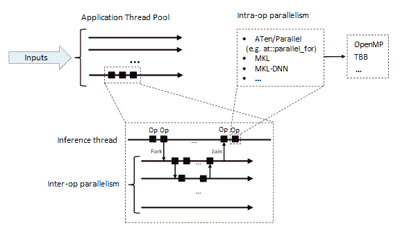

# CPU 线程和 TorchScript 推断

> 原文： [https://pytorch.org/docs/stable/notes/cpu_threading_torchscript_inference.html](https://pytorch.org/docs/stable/notes/cpu_threading_torchscript_inference.html)

PyTorch 允许在 TorchScript 模型推断期间使用多个 CPU 线程。 下图显示了在典型应用程序中可以找到的不同级别的并行性：

[](../_images/cpu_threading_torchscript_inference.svg)

一个或多个推理线程在给定的输入上执行模型的前向传递。 每个推理线程都调用一个 JIT 解释器，该解释器逐一执行内联模型的操作。 模型可以利用`fork` TorchScript 原语来启动异步任务。 一次分叉多个操作将导致并行执行任务。 `fork`运算符返回一个`future`对象，该对象可用于以后进行同步，例如：

```
@torch.jit.script
def compute_z(x):
    return torch.mm(x, self.w_z)

@torch.jit.script
def forward(x):
    # launch compute_z asynchronously:
    fut = torch.jit._fork(compute_z, x)
    # execute the next operation in parallel to compute_z:
    y = torch.mm(x, self.w_y)
    # wait for the result of compute_z:
    z = torch.jit._wait(fut)
    return y + z

```

PyTorch 使用单个线程池实现操作间的并行性，该线程池由应用程序过程中分叉的所有推理任务共享。

除了操作间并行性之外，PyTorch 还可以在操作内部利用多个线程(&lt;cite&gt;操作内并行性&lt;/cite&gt;）。 在许多情况下，这可能很有用，包括大张量上的元素操作，卷积，GEMM，嵌入查找等。

## 构建选项

PyTorch 使用内部的 ATen 库来实现操作。 除此之外，PyTorch 还可以通过支持 [MKL](https://software.intel.com/en-us/mkl) 和 [MKL-DNN](https://github.com/intel/mkl-dnn) 等外部库来构建，以加快 CPU 的计算速度。

ATen，MKL 和 MKL-DNN 支持操作内并行，并依靠以下并行库来实现它：

*   [OpenMP](https://www.openmp.org/) -广泛用于外部库中的标准(和库，通常随编译器一起提供）；

*   [TBB](https://github.com/intel/tbb) -针对基于任务的并行性和并发环境优化的更新并行化库。

过去，OpenMP 已被许多库使用。 以相对容易使用和支持基于循环的并行性和其他原语而闻名。 同时，OpenMP 与该应用程序使用的其他线程库之间的良好互操作性并不为人所知。 特别是，OpenMP 不保证在应用程序中将使用单个每个进程的内部操作线程池。 相反，两个不同的互操作线程将可能使用不同的 OpenMP 线程池进行互操作。 这可能会导致应用程序使用大量线程。

TBB 在外部库中使用的程度较小，但同时针对并发环境进行了优化。 PyTorch 的 TBB 后端保证了应用程序中运行的所有操作都使用一个单独的，按进程的单个进程内线程池。

根据使用情况，可能会发现一个或另一个并行化库在其应用程序中是更好的选择。

PyTorch 允许通过以下构建选项来选择构建时 ATen 和其他库使用的并行化后端：

| 

图书馆

 | 

构建选项

 | 

价值观

 | 

笔记

 |
| --- | --- | --- | --- |
| en | `ATEN_THREADING` | `OMP`(默认），`TBB` |  |
| MKL | `MKL_THREADING` | (相同） | 要启用 MKL，请使用`BLAS=MKL` |
| MKL-DNN | `MKLDNN_THREADING` | (same) | 要启用 MKL-DNN，请使用`USE_MKLDNN=1` |

强烈建议不要在一个内部版本中混用 OpenMP 和 TBB。

以上任何`TBB`值都需要`USE_TBB=1`构建设置(默认值：OFF）。 OpenMP 并行性需要单独的设置`USE_OPENMP=1`(默认值：ON）。

## 运行时 API

以下 API 用于控制线程设置：

| 

并行类型

 | 

设定值

 | 

Notes

 |
| --- | --- | --- |
| 互操作并行 | `at::set_num_interop_threads`和`at::get_num_interop_threads`(C ++）`set_num_interop_threads`和`get_num_interop_threads`(Python， [`torch`](../torch.html#module-torch "torch") 模块） | `set*`功能只能在启动期间，实际操作员运行之前被调用一次；默认线程数：CPU 内核数。 |
| 帧内并行 | `at::set_num_threads`，`at::get_num_threads`(C ++）`set_num_threads`，`get_num_threads`(Python， [`torch`](../torch.html#module-torch "torch") 模块）环境变量：`OMP_NUM_THREADS`和`MKL_NUM_THREADS` |

对于操作内并行设置，`at::set_num_threads`，`torch.set_num_threads`始终优先于环境变量，`MKL_NUM_THREADS`变量优先于`OMP_NUM_THREADS`。

注意

`parallel_info`实用程序可打印有关线程设置的信息，并可用于调试。 在 Python 中，也可以通过`torch.__config__.parallel_info()`调用获得类似的输出。