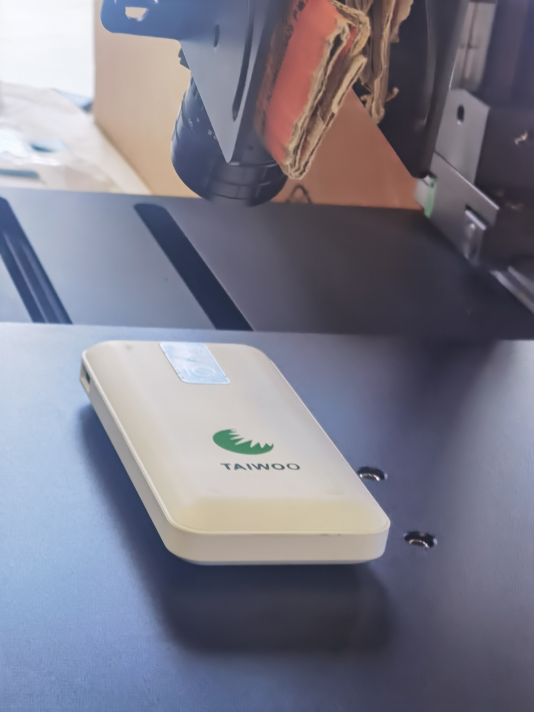
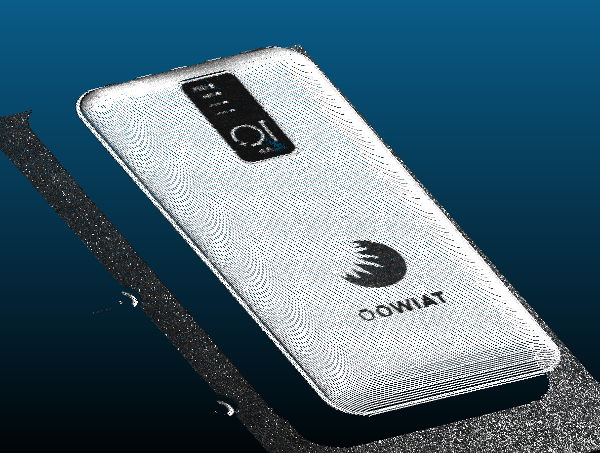
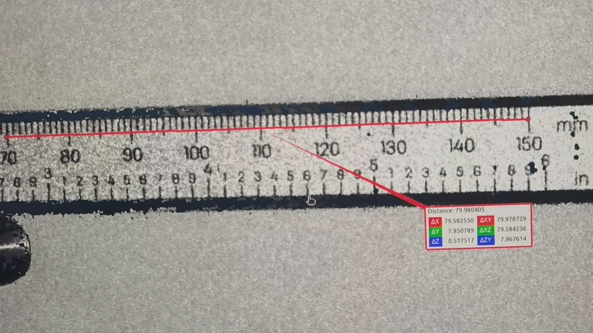
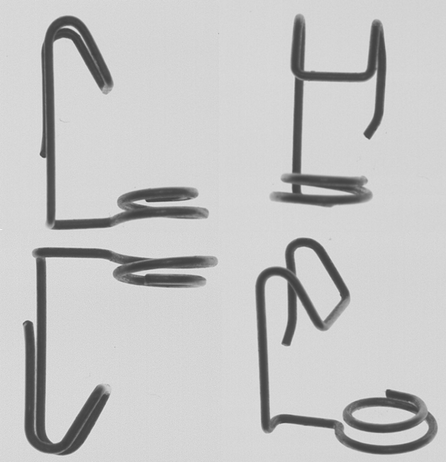

 <h1> 吴安成 </h1>
     

         
             
             134-2828-1619
         
         ·
         
             
             397031272@qq.com
         
         ·
         
             
             <a href="https://ancy397031272.github.io/" target="_blank">My Github</a>
         
         ·
         
             
             <a href="https://blog.csdn.net/u014072827?spm=1000.2115.3001.5343" target="_blank">CSDN</a>
         
     

    

##  个人信息

- 男，1991.2
- 求职意向：算法工程师
- 工作经验：6 年
- 期望薪资：30 - 35k

##  技能清单

* 熟悉双目立体相机、3D激光线扫、双目面结构光的基本原理及搭建

* 熟悉单双目相机标定、手眼标定原理及算法实现

* 熟悉视觉2D、3D引导定位原理及搭建、缺陷检测，AOI检测等

* 熟悉在Linux、window下编程，熟悉git、cmake等工具的使用

* 熟悉Python、C++编程，熟悉 Pycharm、Qt、Clion等IDE的使用 

* 熟悉2D、3D视觉的理论知识，熟练OpenCV、Open3D、PCL编程 

* 会在瑞芯微、香橙派上部署深度学习模型

##  工作及项目经历

**深圳鹰眼智联科技有限公司**				算法工程师			2023.11-至今

★ 料堆体积测量

项目描述**：**砂石场料堆体积过大，现场人员通过经验去评估体积，存在巨大误差，导致库存难以统计。现有的方案大都是通过激光雷达的方式进行三维重建，成本过高。本项目通过相机采集不同视角的图像进行三维重建，对三维重建的点云图像进行去噪、孔洞修补等，最后对划分料堆区域，计算体积。

算法实现：1）使用神经网络[Hierarchical-Localization](https://github.com/cvg/Hierarchical-Localization)提取多视图下的关键点，并将其传入colmap重建管道生成网格模型  2）通过网格几何特征构建坐标系及尺寸还原 3）对网格去噪、孔洞修补  4）对料堆分区域，计算各个料堆的体积，并与如视、数字绿土、飞马这三家的手持激光雷达厂商测量结果比较，我们的精度可达到95%左右。

<video src="./data/falconix/料堆测量/视频/料堆测量.mp4"></video>

★ 3d激光线扫搭建

项目描述**：**从零开始搭建一套3D线扫结构光，要求工作距离200mm，x方向视野180mm，精度达到0.01mm以上

算法实现：1）相机（2048*2048）+镜头选型（16mm）  2）高精度单目标定算法的实现，单目标定重投影误差约为0.052319个像素 3）使用最小二乘法拟合激光平面  4）根据运动平台的位移量及标定板在相机坐标系下的位移量，标定位移平台 4）根据激光平面+提取的激光线+相机模型计算点云

★ 双目面结构光搭建   

项目描述**：**从零开始搭建一套双目结构光相机，要求工作距离500mm，fov为200*160mm。精度达到0.1mm以上。

算法实现：1）相机（1448*1080）+镜头选型（12mm）  2）高精度双目标定算法的实现，双目标定重投影误差约为0.055015个像素 3）激光振镜控制开发  4）条纹编解码+匹配算法的实现 5）重建点云
<video src="./data/falconix/结构光/VID_20240808_132608.mp4"></video>

<video src="./data/falconix/结构光/VID_20240808_132949.mp4"></video>

<video src="./data/falconix/结构光/VID_20240808_133220.mp4"></video>

<video src="./data/falconix/结构光/VID_20240808_133616.mp4"></video>

<video src="./data/falconix/结构光/wx_camera_1722506265771.mp4"></video>

<video src="./data/falconix/结构光/VID_20240808_132608.mp4"></video>

**南京华视智能科技股份有限公司**			算法工程师   2023.4-2023.11

★ 基于3D视觉的定位引导及在线检测系统   

项目描述**：**该系统通过3D相机采集目标工件的点云并识别出其位姿信息。并根据模板上预定义的检测孔位距离信息，精准识别出场景中工件的开孔距离(识别误差0.5mm)，并判断是否满足预设值。对合格的工件通过机器人抓取并放置到指定的装配台上（装配误差0.5mm）。

算法实现：1）实现戳点式的手眼标定算法，目前手眼标定误差精度约0.3mm；2) 实现ppf + icp算法，并集成于open3d中，并用于当前项目的位姿估计，识别时间约400ms ；3)  将位姿估计的位姿通过手眼标定矩阵，转换到机器人坐标系下，达到了0.5mm的抓取精度。
<video src="./data/wal/调试.mp4"></video>

**深圳市如本科技有限公司**				视觉研发工程师		2021.4-2023.4

★ 基于3D视觉的鞋涂系统的开发

项目描述**：**传统鞋业面临着招工难、成本日益增长、品质难以保证等问题，市面也有一些公司尝试用机器换人的方法：如示教涂胶等，但由于鞋型品类繁多、工艺复杂等原因，都没有很好的实际落地使用。我们基于3D重建技术及轨迹提取技术精确地将轨迹点提取出来，并将其发送给机器人系统，机器人实时规划轨迹，从而完成了涂胶作业，目前实现的功能包括鞋面涂胶注册、鞋面涂胶及鞋底涂胶，并已经在鞋厂落地部署。
<video src="./data/rvbust/鞋涂项目预览.mp4"></video>

算法实现：1）注册工位：首先使用3D相机通过多视角采集点云，并将其进行多视角配准，从而得到三维重建模型；然后通过HSV将绘制在美纹纸上的轨迹提取出来，通过样条曲线对其进行拟合及按间距进行采样；最后将提取出来的轨迹点及其法向量通过UI呈现出来，用户微调及确认无误后将模板模型及点位信息发送给鞋面涂胶工位。
<video src="./data/rvbust/注册工位/注册.mp4"></video>

2）鞋面涂胶工位：首先使用3D相机采集场景中的鞋子点云，根据平台平面标定及鞋子到平台的距离对点云进行裁剪从而去除噪声点云；然后根据裁剪出来的点云与注册工位得到的模板点云进行检验，包括：鞋子大小、左右脚、超出视野以及有无鞋；接着对裁剪出来的点云与模板点云进行ppf+icp匹配，从而得到当前鞋子的pose；最后将所有轨迹点乘以手眼标定+工具标定+pose等到最终的涂胶轨迹。
<video src="./data/rvbust/鞋面工位/标定验证.mp4"></video>
3）鞋底涂胶工位：首先使用3D相机采集场景中的鞋底点云，并通过平台平面标定及点云的主成分信息，将场景中的鞋底的点云提取出来；接着根据鞋底外边缘的高于鞋底的信息得到外圈涂胶轨迹，并将外边缘轨迹进行内缩一定距离得到内圈涂胶轨迹；最后将所有轨迹点乘以手眼标定+工具标定等到最终的涂胶轨迹。
<video src="./data/rvbust/鞋底工位/流程.mp4"></video>

<video src="./data/rvbust/鞋底工位/shoe.mp4"></video>

★ 基于3D视觉的机加工上下料项目

项目描述：本项目使用3D相机采集料盘中的工件，然后与提前准备好的 cad模型or点云模板进行位姿估计，从而自动计算世界坐标系下的真实工件位置和旋转，并通过TCP/IP的方式将结果传输给客户端，从而指导机器臂灵活分捡不同形状的物体。

算法实现：此软件由通讯模块，标定模块，模板注册模块以及视觉识别模块组成。其中:

● 通讯模块负责建立此软件与客户端的接连, 以及实现基本的通信协议的内容。

● 标定模块负责标定3D相机与机器臂的转换关系（手眼标定）, 以及相机与抓取平面的相对关系。

● 模板注册模块根据提供的 CAD三维文件或者点云数据, 计算出视觉算法所需要的数据模型。

● 视觉识别模块根据注册好的物体模型, 计算3D相机所拍的点云数据中真是物体的位置和旋转。
<video src="./data/rvbust/catch/wx_camera_1679311807236.mp4"></video>

**鲁班嫡系机器人（深圳）有限公司**		图像算法工程师		2018.3-2021.4

★ AOI算法开发  

项目描述：公司的主要业务是电源，电源适配器等的生产，为了提高自动化程度、降低产品的次品率，由此AOI检测设备必不可少。项目需求：

* 能快速检测出市面上AOI检测设备所能检测的元件的缺陷类型；

*  减少新建板子的时间；

* 采用合理的打光方案，使缺陷特征明显；

* 甄选健壮的图像处理算法，提高直通率；

* 简单的操作界面，使用户容易上手

算法实现：1）根据Gerber焊盘图，自动获取算法建议值；2）通过Gerber图及原图作为模板对的焊盘定位；3）采用linemod算法进行本体定位，并且使用像素值的配准方式提高匹配精度；4）对图像进行相应的预处理，提高条码识别率；5）mysql数据库的设计及搭建，保证海量数据的存储速度及检索速度； 6）封装模板匹配算法实现ocv算法；7）为各种元件定制相应的算法

<video src="./data/rr/rr_aoi_run.mp4"></video>

★ AOI返修平台

项目描述：AOI可实现PCB板的不良元件的缺陷的检测，并将检测结果保存到数据库中。目前市面上AOI的返修软件都是基于pc端的，工人需要对照pc端的缺陷图像才能找到PCB的对应缺陷元件的位置。本项目创新地用投影仪具有缺陷的位置展示出来，大大地降低工人的维修时间。项目需求：

* 快速地从数据库中检索出缺陷数据；

* 支持多种获取数据方式，包括：扫描枪，相机，手动输入，根据最近时间等；

* 用投影仪将缺陷软件位置用彩色的圆点指示出来；

* 支持全部缺陷显示和单个缺陷显示

* 支持显示缺陷元件的缺陷图片和模板图片

算法实现： 1）通过web_cam识别载具上的marker点及投影仪投在载具上的标定板图像，计算出投影仪到载具上的单应性矩阵；2）通过千兆网从AOI主机上数据上检索当前PCB板子的数据信息；3）通过单应性矩阵将缺陷位置投射到PCB板上，将缺陷信息投影在载具指定位置。
<video src="./data/rr/返修台/返修台.mp4"></video>

★ 电源装配系统视觉算法的开发

项目描述：弹弓为电源装配的主要元器件，本项目的目的是视觉引导机械手抓取被打弹弓机打出来的弹弓，将其放置到指定的位置，并检测出抓取的弹弓是否被打弹弓机损坏。项目需求：快速识别弹弓位置，并引导机械手将其放置到指定位置

算法实现：1）对机械手进行眼手标定 2）为各种姿态下的弹弓训练linemod模型用于后续的识别3）对ccd读取到的弹弓图片进行预处理，将靠在一起的弹弓标为非抓取 4）通过linemod算法识别出抓取的坐标，并转为机械手坐标，引导机械手移动过去将其抓取并放到指定位置 5）通过resnet模型判断弹弓是否损坏。

<video src="./data/rr/cls_spring.mp4"></video>

<video src="./data/rr/linemod_train.mp4"></video>

<video src="./data/rr/抓取.mp4"></video>

##  教育经历

★ 2015.09-2018.06			广东工业大学         			机械工程（硕士）

★ 2011.09-2015.06		        五邑大学					机械工程（本科）

##  自我评价

本人责任心强，具有较好的团队意识，学习能力强，适应能力强，能够灵活地将2D、3D以及深度学习相关领域的知识应用于项目中，有阅读过Open3D及PCL部分源码，熟悉往Open3D及OpenCV源码添加个人代码，如位姿估计等，并成功应用于项目中；对3D线扫和结构光有一定基础，可从零搭建。