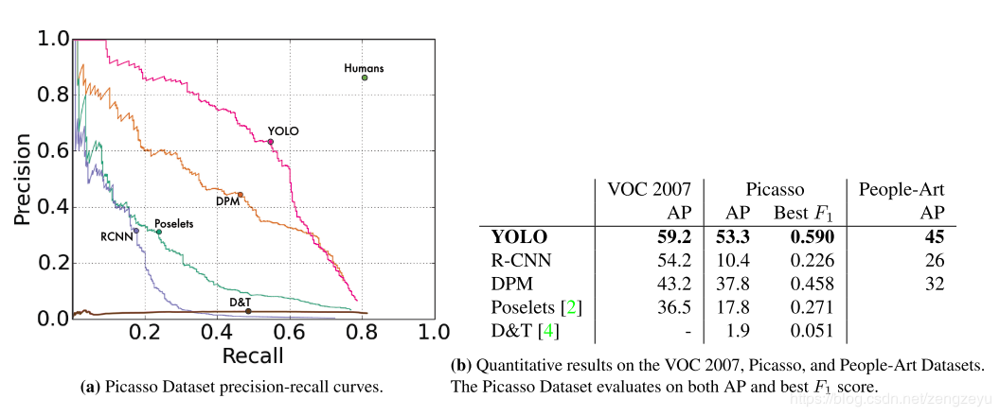

# YOLO系列论文翻译

## YOLOv1

### 简介

YOLO为一种新的目标检测方法，该方法的特点是实现快速检测的同时还达到较高的准确率。作者将目标检测任务看作目标区域预测和类别预测的回归问题。该方法采用单个神经网络直接预测物品边界和类别概率，实现端到端的物品检测。同时，该方法检测速非常快，基础版可以达到45帧/s的实时检测；FastYOLO可以达到155帧/s。与当前最好系统相比，YOLO目标区域定位误差更大，但是背景预测的假阳性优于当前最好的方法。

### 1. 前言

人类视觉系统快速且精准，只需瞄一眼（You Only Look Once，YOLO）即可识别图像中物品及其位置。

传统目标检测系统采用deformable parts models  (DPM)方法，通过滑动框方法提出目标区域，然后采用分类器来实现识别。近期的R-CNN类方法采用region proposal  methods，首先生成潜在的bounding boxes，然后采用分类器识别这些bounding  boxes区域。最后通过post-processing来去除重复bounding  boxes来进行优化。这类方法流程复杂，存在速度慢和训练困难的问题。

本文中，我们将目标检测问题转换为直接从图像中提取bounding boxes和类别概率的单个回归问题，只需一眼（you only look once，YOLO）即可检测目标类别和位置。

YOLO采用单个卷积神经网络来预测多个bounding boxes和类别概率，如Figure-1所示。本方法相对于传统方法有如下有优点：

一，非常快。YOLO预测流程简单，速度很快。我们的基础版在Titan X GPU上可以达到45帧/s； 快速版可以达到150帧/s。因此，YOLO可以实现实时检测。

二，YOLO采用全图信息来进行预测。与滑动窗口方法和region  proposal-based方法不同，YOLO在训练和预测过程中可以利用全图信息。Fast  R-CNN检测方法会错误的将背景中的斑块检测为目标，原因在于Fast R-CNN在检测中无法看到全局图像。相对于Fast  R-CNN，YOLO背景预测错误率低一半。

三，YOLO可以学习到目标的概括信息（generalizable representation），具有一定普适性。我们采用自然图片训练YOLO，然后采用艺术图像来预测。YOLO比其它目标检测方法（DPM和R-CNN）准确率高很多。

YOLO的准确率没有最好的检测系统准确率高。YOLO可以快速识别图像中的目标，但是准确定位目标（特别是小目标）有点困难。

### 2. 统一检测(Unified Detection)

作者将目标检测的流程统一为单个神经网络。该神经网络采用整个图像信息来预测目标的bounding boxes的同时识别目标的类别，实现端到端实时目标检测任务。

如图Figure-2所示，YOLO首先将图像分为S×S的格子（grid  cell）。如果一个目标的中心落入格子，该格子就负责检测该目标。每一个格子（grid cell）预测bounding  boxes（B）和该boxes的置信值（confidence score）。置信值代表box包含一个目标的置信度。然后，我们定义置信值为  $Pr(Object) * IOU^{truth}_{pred}$。如果没有目标，则置信值为零。另外，我们希望预测的置信值和ground  truth的intersection over union (IOU)相同。

每一个bounding box包含5个值：x，y，w，h和confidence。（x，y）代表与格子相关的box的中心。（w，h）为与全图信息相关的box的宽和高。confidence代表预测boxes的IOU和ground truth。

每个格子（grid cell）预测条件概率值C（$Pr(Class_i | Object)$）。概率值C代表了格子包含一个目标的概率，每一格子只预测一类概率。在测试时，每个box通过类别概率和box置信度相乘来得到特定类别置信分数：
$Pr(Class*i|Object)\*Pr(Object)\*IOU^{truth}*{pred} = Pr(Class*i)\*IOU^{truth}*{pred}$

这个分数代表该类别出现在box中的概率和box和目标的合适度。在PASCAL VOC数据集上评价时，我们采用S=7，B=2，C=20（该数据集包含20个类别），最终预测结果为7×7×30的tensor。

#### 2.1 网络结构

模型采用卷积神经网络结构。开始的卷积层提取图像特征，全连接层预测输出概率。模型结构类似于GoogleNet，如图Figure-3所示。作者还训练了YOLO的快速版本（Fast YOLO）。Fast YOLO模型卷积层和filter更少。最终输出为7×7×30的tensor。

#### 2.2 训练方法

作者采用ImageNet 1000-class 数据集来预训练卷积层。预训练阶段，采用图2-2网络中的前20卷积层，外加average-pooling  层和全连接层。模型训练了一周，获得了top-5 accuracy为0.88（ImageNet2012 validation  set），与GoogleNet模型准确率相当。然后，将模型转换为检测模型。作者向预训练模型中加入了4个卷积层和两层全连接层，提高了模型输入分辨率（224×224->448×448）。顶层预测类别概率和bounding box协调值。bounding box的宽和高通过输入图像宽和高归一化到0-1区间。顶层采用linear activation，其它层使用  leaky rectified linear。作者采用sum-squared error为目标函数来优化，增加bounding box  loss权重，减少置信度权重，实验中，设定为$\lambda*{coord} = 5 and \lambda*{noobj}=0.5$。

训练阶段的总loss函数如下：

作者在PASCAL VOC2007和PASCAL VOC2012数据集上进行了训练和测试。训练135轮，batch  size为64，动量为0.9，学习速率延迟为0.0005. Learning  schedule为：第一轮，学习速率从0.001缓慢增加到0.01（因为如果初始为高学习速率，会导致模型发散）；保持0.01速率到75轮；然后在后30轮中，下降到0.001；最后30轮，学习速率为0.0001.

作者还采用了dropout和 data augmentation来预防过拟合。dropout值为0.5；data augmentation包括：random scaling，translation，adjust exposure和saturation。

#### 2.3 预测

对于PASCAL VOC数据集，模型需要对每张图片预测98个bounding box和对应的类别。对于大部分目标只包含一个box；其它有些面积大的目标包含了多个boxes，采用了Non-maximal suppression（非最大值抑制）来提高准确率。

#### 2.4 缺点

1. YOLO的每一个网格只预测两个boxes，一种类别。这导致模型对相邻目标预测准确率下降。因此，YOLO对成队列的目标（如 一群鸟）识别准确率较低。
2. YOLO是从数据中学习预测bounding boxes，因此，对新的或者不常见角度的目标无法识别。
3. YOLO的loss函数对small bounding boxes和large bounding boxes的error平等对待，影响了模型识别准确率。因为对于小的bounding boxes，small error影响更大。

### 3. 效果对比

文中比较了YOLO和其它目标检测方法（Deformable parts models，R-CNN，Faster R-CNN，Deep MultiBox，OverFeat，MultiGrasp）

### 4. 实验结果

#### 4.1 与其它检测方法效果对比

如表Table-1所示，在准确率保证的情况下，YOLO速度快于其它方法。

#### 4.2 VOC2007 错误项目分析

文中比较了YOLO和Faster R-CNN的错误情况，结果如图4-1所示。YOLO定位错误率高于Fast R-CNN；Fast R-CNN背景预测错误率高于YOLO。

预测结果包括以下几类：

正确：类别正确，IOU>0.5

定位：类别正确，0.1<IOU<0.5

类似：类别相似，IOU>0.1

其它：类别错误，IOU>0.1

背景：IOU<0.1

图4-1 错误项目分析

#### 4.3 结合Fast R-CNN和YOLO

YOLO和Fast R-CNN预测错误类型不同，因此可以结合两类模型，提升结果。结果如表4-2所示。

表4-2 模型结合

#### 4.4 VOC 2012结果

VOC2012数据集上测试结果如表4-3所示。

表4-3 VOC2012数据集测试结果

#### 4.5 普适性

我们在其它数据集（艺术品目标检测）：Picasso Dataset和People-Art Dataset测试了YOLO的性能，结果如图4-2和图4-3所示。

图4-2 艺术品目标检测结果一

图4-3 艺术品目标检测结果二 

### 5. 实时检测

作者测试了YOLO的实时检测效果，结果参见 YouTube channel: https://goo.gl/bEs6Cj（可惜要翻墙才能看）。

### 6. 结论

YOLO为一种基于单独神经网络模型的目标检测方法，具有特点可以高准确率快速检测，同时具有一定鲁棒性，可以适用于实时目标检测。

**参考：**

https://zhuanlan.zhihu.com/p/25045711

------

## YOLOv2

### 简介

YOLO9000是可以检测超过9000种类别的实时检测系统。首先，作者在YOLO基础上进行了一系列的改进，产生了YOLOv2。YOLOv2在PASCAL VOC和COCO数据集上获得了目前最好的结果（state of the  art）。然后，采用多尺度训练方法，YOLOv2可以根据速度和精确度需求调整输入尺寸。67FPS时，YOLOv2在VOC2007数据集上可以达到76.8mAP；40FPS，可以达到78.6mAP，比目前最好的Faster  R-CNN和SSD精确度更高，检测速度更快。最后提出了目标检测和分类的共训练方法。采用该方法，作者分别在COCO目标检测数据集和ImageNet分类数据集上训练了YOLO9000。联合训练使YOLO9000可以预测没有labelled的目标检测数据。YOLO9000在ImageNet验证集（200类）上获得了19.7mAP。其中，156类没有出现在COCO训练集中，YOLO9000获得了16.0mAP。YOLO9000可以实时识别超过9000类别。

### 1. 前言

目标检测系统要求快速，准确以及能识别大范围种类数量。但是，目前基于深度神经网络方法的目前检测系统能识别的物品种类较少。其原因在于：相对于物品分类数据集，目标检测数据集中的物品种类较少。标记目标识别数据集所耗费的精力远大于标记物品分类数据集。物品分类数据集包含成千上万种超过数百万张图片，而目标识别数据集就很小了。

本文中，作者提出了一种结合不同类型数据集的方法。基于该方法，作者提出了一种新的联合训练方法，结合目前物品分类数据集的优点，将其应用于训练目标检测模型。模型可以从目标检测数据集中学会准确定位目标，同时从物品分类数据集中学会识别更多的种类，增强模型的鲁棒性。

采用该方法，作者训练了可以识别超过9000种物品的实时目标检测与识别系统-YOLO9000。首先，作者在YOLO的基础上进行了改进，产生了YOLOv2（state of the  art）。然后，作者采用数据集结合方法和联合训练方法，采用ImageNet和COCO数据集训练该模型，使该模型可以识别和检测超过9000种类别。

### 2. 优化-YOLOv2

YOLO相对于目前最好的目标检测系统存在的问题是精确度不够。错误项目分析显示，相对于Fast R-CNN，YOLO在目标定位方面错误率较高。因此，对于YOLO的改进集中于在保持分类准确率的基础上增强定位精确度。改进的项目如Table 2所示。

#### 2.1 Batch Normalization

Batch Normalization可以提高模型收敛速度，减少过拟合。作者在所有卷积层应用了Batch Normalization，使结果提升了2%。同时，Batch Normalization的应用，去除了dropout，而不会过拟合。

#### 2.2 High Resolution Classifier

目前最好的图像分类器采用基于ImageNet数据集预训练模型。大部分类器输入图像尺寸小于256×256。原始YOLO接受图像尺寸为224×224。在YOLOv2中，作者首先采用448×448分辨率的ImageNet数据finetune使网络适应高分辨率输入；然后将该网络用于目标检测任务finetune。高分辨率输入使结果提升了4%mAP。

#### 2.3 Convolutional With Anchor Boxes

YOLO采用全连接层来直接预测bounding boxes，而Fast R-CNN采用人工选择的bounding boxes。Fast R-CNN中的 region proposal  network仅采用卷积层来预测固定的boxes（anchor boxes）的偏移和置信度。

作者去除了YOLO的全连接层，采用固定框（anchor boxes）来预测bounding  boxes。首先，去除了一个pooling层来提高卷积层输出分辨率。然后，修改网络输入尺寸：由448×448改为416，使特征图只有一个中心。物品（特别是大的物品）更有可能出现在图像中心。YOLO的卷积层下采样率为32，因此输入尺寸变为416,输出尺寸为13×13。

采用anchor boxes，提升了精确度。YOLO每张图片预测98个boxes，但是采用anchor  boxes，每张图片可以预测超过1000个boxes。YOLO模型精确度为69.5mAP，recall为81%；采用anchor  boxes方法后，结果为69.2mAP，recall为88%。

#### 2.4 Dimension Clusters

在YOLO模型上采用anchor  boxes有两个关键。第一，box维度为人工选择。模型可以学会适应boxes，但是如果人工选择更好的boxes，可以让模型更加容易学习。我们采用K-means聚类方法来自动选择最佳的初始boxes。我们希望的是人工选择的boxes提高IOU分数，因此，我们公式定义为：$d(box, centroid) = 1 - IOU(box, centroid)$。k-means结果如图Figure-2所示，作者选择了k=5。

#### 2.5 Direct location prediction

在YOLO模型上采用anchor boxes的第二个关键是模型不稳定性，特别是在前面几轮训练。大部分不稳定因素来源于预测boxes位置（x，y）。

作者将预测偏移量改变为YOLO的预测grid cell的位置匹配性（location  coordinate），将预测值限定在0-1范围内，增强稳定性。网络对feature map中的每个cell预测5个bounding  boxes。对每一个bounding boxes，模型预测5个匹配性值（$t*{x},t*{y} ,t*{w} ,t*{h} ,t_{o}$）。采用k-means聚类方法选择boxes维度和直接预测bounding boxes中心位置提高YOLO将近5%准确率

#### 2.6 Fine-Grained Features

改进后的YOLO对13×13的feature map进行目标检测。更精确的特征（finer grained  features）可以提高对于小目标的检测。作者向网络加入passtrough层以增加特征。passthrough类似于ResNet，将高分辨率特征和低分辨率特征结合，使26×26×512的特征图转化为13×13×2048的特征图。该改进增加了1%的性能。

#### 2.7 Multi-Scale Training（多尺度训练）

最初的YOLO输入尺寸为448×448，加入anchor boxes后，输入尺寸为416×416。模型只包含卷积层和pooling 层，因此可以随时改变输入尺寸。

作者在训练时，每隔几轮便改变模型输入尺寸，以使模型对不同尺寸图像具有鲁棒性。每个10 batches，模型随机选择一种新的输入图像尺寸（320，352，…，608，32的倍数，因为模型下采样因子为32），改变模型输入尺寸，继续训练。

该训练规则强迫模型取适应不同的输入分辨率。模型对于小尺寸的输入处理速度更快，因此YOLOv2可以按照需求调节速度和准确率。在低分辨率情况下（288×288），YOLOv2可以在保持和Fast R-CNN持平的准确率的情况下，处理速度可以达到90FPS。在高分辨率情况下，YOLOv2在VOC2007数据集上准确率可以达到state  of the art（78.6mAP），如表2-2所示。

### 3. 检测更加快速(Faster)

大部分检测框架是基于VGG-16作为特征提取网络，但是VGG-16比较复杂，耗费计算量大。YOLO框架使用了类似googlenet的网络结构，计算量比VGG-16小，准确率比VGG16略低。

#### 3.1 Darknet-19

作者设计了一个新的分类网络（Darknet-19）来作为YOLOv2的基础模型。Darknet-19模型结构如表3-1所示。

#### 3.2 分类任务训练

作者采用ImageNet1000类数据集来训练分类模型。训练过程中，采用了 random crops, rotations, and hue, saturation, and exposure shifts等data  augmentation方法。预训练后，作者采用高分辨率图像（448×448）对模型进行finetune。

#### 3.3 检测任务训练

作者将分类模型的最后一层卷积层去除，替换为三层卷积层（3×3,1024  filters），最后一层为1×1卷积层，filters数目为需要检测的数目。对于VOC数据集，我们需要预测5个boxes，每个boxes包含5个适应度值，每个boxes预测20类别。因此，输出为125（5*20+5*5） filters。最后还加入了passthough 层。

### 4. 更强(stronger)

作者提出了将分类数据和检测数据综合的联合训练机制。该机制使用目标检测标签的数据训练模型学习定位目标和检测部分类别的目标；再使用分类标签的数据取扩展模型对多类别的识别能力。在训练的过程中，混合目标检测和分类的数据集。当网络接受目标检测的训练数据，反馈网络采用YOLOv2 loss函数；当网络接受分类训练数据，反馈网络只更新部分网络参数。

这类训练方法有一定的难度。目标识别数据集仅包含常见目标和标签（比如狗，船）；分类数据集包含更广和更深的标签。比如狗，ImageNet上包含超过100种的狗的类别。如果要联合训练，需要将这些标签进行合并。

大部分分类方法采用softmax输出所有类别的概率。采用softmax的前提假设是类别之间不相互包含（比如，犬和牧羊犬就是相互包含）。因此，我们需要一个多标签的模型来综合数据集，使类别之间不相互包含。

#### 4.1 多层分类(Hierarchical classification)

数据处理…

### 5. 结论

作者通过对YOLO网络结构和训练方法的改进，提出了YOLOv2和YOLO9000两种实时目标检测系统。YOLOv2在YOLO的基础上进行了一系列的改进，在快速的同时达到state of the art。同时，YOLOv2可以适应不同的输入尺寸，**根据需要调整检测准确率和检测速度（值得参考）**。作者综合了ImageNet数据集和COCO数据集，采用联合训练的方式训练，使该系统可以识别超过9000种物品。除此之外，作者提出的WordTree可以综合多种数据集 的方法可以应用于其它计算机数觉任务中。

**参考：**

https://zhuanlan.zhihu.com/p/25052190

------

## YOLOv3

### 简介

本文为YOLO提供了一系列更新！它包含一堆小设计，可以使系统的性能得到更新；也包含一个新训练的、非常棒的神经网络，虽然比上一版更大一些，但精度也提高了。不用担心，虽然体量大了点，它的速度还是有保障的。在输入320×320的图片后，YOLOv3能在22毫秒内完成处理，并取得28.2mAP的成绩。它的精度和SSD相当，但速度要快上3倍。和旧版数据相比，v3版进步明显。在Titan  X环境下，YOLOv3的检测精度为57.9AP5057.9AP50，用时51ms；而RetinaNet的精度只有57.5AP，但却需要198ms，相当于YOLOv3的3.8倍。

### 前言

无

### 2. 方法

#### 2.1 Bounding Box Prediction

这里和原来v2基本没区别。仍然使用聚类产生anchor box的长宽（下式的pwpw和phph）。网络预测四个值：tx，ty，tw，th。我们知道，YOLO网络最后输出是一个M×M的feature  map，对应于M×M个cell。如果某个cell距离image的top left  corner距离为(cx,cy)（也就是cell的坐标），那么该cell内的bounding box的位置和形状参数为：

PS：这里有一个问题，不管FasterRCNN还是YOLO，都不是直接回归bounding box的长宽（就像这样：$bw=p_w*e^{t_w}$），而是要做一个对数变换，实际预测的是$log(⋅)$。这里小小解释一下。

这是因为如果不做变换，直接预测相对形变$t_w$，那么要求$t_w>0$，因为你的框框的长宽不可能是负数。这样，是在做一个有不等式条件约束的优化问题，没法直接用SGD来做。所以先取一个对数变换，将其不等式约束去掉，就可以了。

在训练的时候，使用平方误差损失。

另外，YOLO会对每个bounding  box给出是否是object的置信度预测，用来区分objects和背景。这个值使用logistic回归。当某个bounding  box与ground truth的IoU大于其他所有bounding box时，target给11；如果某个bounding  box不是IoU最大的那个，但是IoU也大于了某个阈值（我们取0.5），那么我们忽略它（既不惩罚，也不奖励），这个做法是从Faster  RCNN借鉴的。我们对每个ground truth只分配一个最好的bounding box与其对应（这与Faster  RCNN不同）。如果某个bounding box没有被assign到任何一个ground  truth对应，那么它对边框位置大小的回归和class的预测没有贡献，我们只惩罚它的objectness，即试图减小其confidence。

#### 2.2 分类预测(Class Prediction)

我们不用softmax做分类了，而是使用独立的logisitc做二分类。这种方法的好处是可以处理重叠的多标签问题，如Open Image Dataset。在其中，会出现诸如`Woman`和`Person`这样的重叠标签。

#### 2.3 多尺度预测(Prediction Across Scales)

之前YOLO的一个弱点就是缺少多尺度变换，使用[FPN](https://arxiv.org/abs/1612.03144)中的思路，v3在3个不同的尺度上做预测。在COCO上，我们每个尺度都预测3个框框，所以一共是9个。所以输出的feature map的大小是N×N×[3×(4+1+80)]]。

然后我们从两层前那里拿feature map，upsample 2x，并与更前面输出的feature  map通过element-wide的相加做merge。这样我们能够从后面的层拿到更多的高层语义信息，也能从前面的层拿到细粒度的信息（更大的feature map，更小的感受野）。然后在后面接一些conv做处理，最终得到和上面相似大小的feature map，只不过spatial  dimension变成了2倍。

照上一段所说方法，再一次在final scale尺度下给出预测。

#### 2.4 特征提取器(Feature Extractor)

加入Res_Block的Darknet-53。

### 3. How We Do

把YOLO  v3和其他方法比较，优势在于快快快。当你不太在乎IoU一定要多少多少的时候，YOLO可以做到又快又好。作者还在文章的结尾发起了这样的牢骚：使用了多尺度预测，v3对于小目标的检测结果明显变好了。不过对于medium和large的目标，表现相对不好。这是需要后续工作进一步挖局的地方。

### 4. Things We Tried That Didn’t Work

作者还贴心地给出了什么方法没有奏效。

- anchor box坐标(x,y)(x,y)的预测。预测anchor box的offset，no stable，不好。
- 线性offset预测，而不是logistic。精度下降。
- focal loss。精度下降。
- 双IoU阈值，像Faster RCNN那样。效果不好。

**参考：**

https://xmfbit.github.io/2018/04/01/paper-yolov3/
